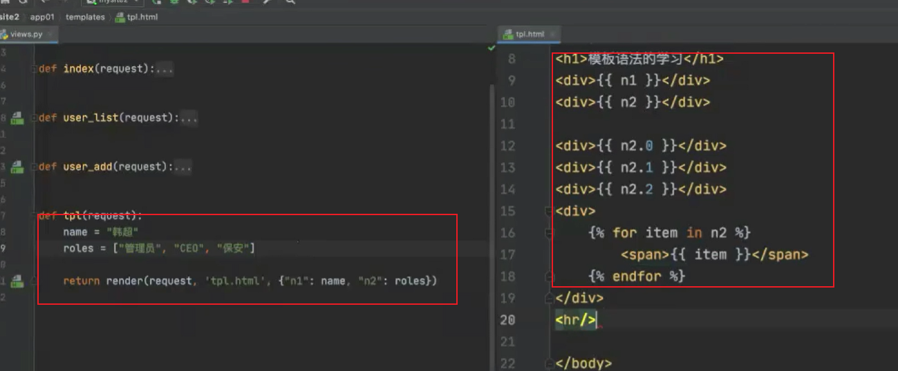
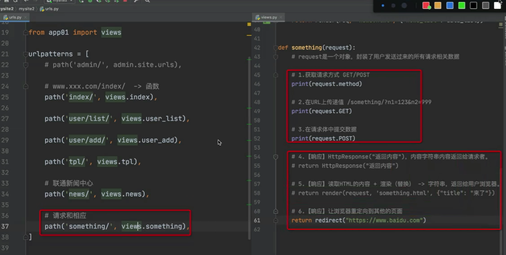
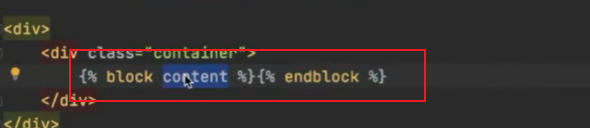

# Django


## 快速搭建环境

```python
pip install django

C:\Users\yangle\AppData\Local\Programs\Python\Python39\Scripts\django-admin.exe startproject 项目名称
    python manage.py startapp app01
    python manage.py runserver
    
```

这里为空字典 []  即为当前目录


应用注册


## Template

render --html文件进行加载渲染

## Static 目录




## 模板语法





### render 


data为列表

```python
def test(request):
    data=['hello','world']
    return render(request,'test.html',{'data':data})

<div>{{ data }}</div>
<div>{{ data.0 }}</div>
<div>{{ data.1 }}</div>


```

data为字典

```python
def test(request):
    data={'k1':'hello','k2':'world'}
    return render(request,'test.html',{'data':data})
<h1> hello world</h1>
<div>{{ data }}</div>
<div>{{ data.k1 }}</div>
<div>{{ data.k2 }}</div>
<h2>遍历key,value</h2>

    {{ key }}: {{ value }}  <br/>

```


## 请求与响应




## ORM

```
pip install mysqlclient

python manage.py makemigrations
python manage.py migrate

```

### Docker 运行mysql

```shell
docker run \
--name mysql \
-d \
-p 33306:3306 \
--restart unless-stopped \
-v /root/data/docker_data/mysql/log:/var/log/mysql \
-v /root/data/docker_data/mysql/data:/var/lib/mysql \
-v /root/data/docker_data/mysql/conf:/etc/mysql \
-v  /root/data/docker_data/mysql/mysql-files:/var/lib/mysql-files \
-e MYSQL_ROOT_PASSWORD=123456 \
mysql:latest


docker exec -it mysql /bin/bash

ALTER USER 'root'@'%' IDENTIFIED BY 'Qwert!2345';
update user set host='%' where user='root';
FLUSH PRIVILEGES;

mysql -u root -P 33306
alter user 'root'@'%' identified with mysql_native_password by 'Qwert!2345';
FLUSH PRIVILEGES;

参考 https://blog.csdn.net/qq_43781399/article/details/112650755
```

```
from app01.models import Person
def ormtest(request):
    Person.objects.create(name='scott',age=10)
    Person.objects.create(name='jack', age=20)
    return HttpResponse("data written success")
    
 

```


charfield

interfield

decimalfield

datatimefield

ForeginKey  # 表约束


模板语法不能加上括号


## 模板继承

### 母版




### 子版继承


###  用户提交字段校验1


### 用户提交字段校验2 （钩子方法）


## from 与 modelform


##  Ajax


### Get请求


### Post请求


免除csrf token 认证--- dom


### jquery


### ajax 请求返回值


### form


#### 错误信息整理


### 添加成功后页面刷新


###  对话框


## refer

https://www.bilibili.com/video/BV1NL41157ph/?p=2&spm_id_from=pageDriver&vd_source=f796b80cb80d8080a1ce1ba33567563e

https://www.cnblogs.com/wupeiqi/


```shell
git init
git add .
git commit -m "first commit" 


 git remote add origin git@github.com:yangle92/Webdjango.git

```


