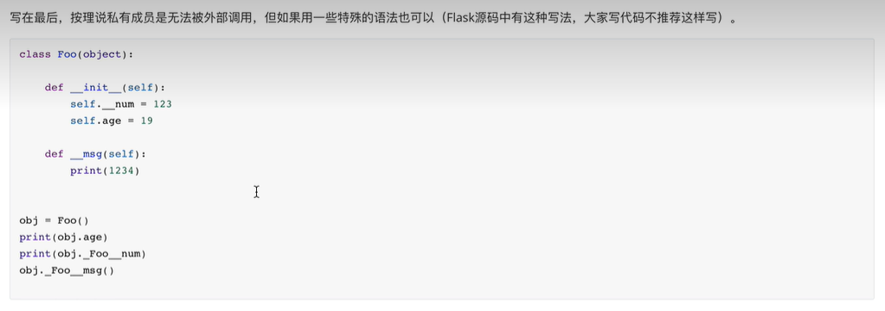

# 面向对象

## 封装，继承，多态

封装是指  将类变量 实例变量 类方法都放到Class下面，以便调用。 减少代码重复

继承是指  子类继承父类的属性，变量和方法，继承的原则是 谁调用优先用谁的属性和方法

多态是指 同一事物的多种形态，可以理解为类的属性，变量和方法


## 面向对象成员   变量 方法 属性


- 面向对象编程是一种编程范式，它把数据和操作数据的方法封装在一起，形成对象。对象之间可以通过消息传递进行交互。面向对象编程有三大特性：封装，继承，多态。

- 封装是指隐藏对象的内部细节，只对外暴露必要的接口。封装可以保护对象的状态，提高代码的可维护性和安全性。在Python中，可以通过在属性或方法名前加两个下划线`__`来表示私有权限，只能在类内部访问。也可以通过定义公有方法来间接修改或访问私有属性。

- 继承是指子类可以继承父类的属性和方法，并且可以重写或扩展父类的功能。继承可以实现代码的复用，减少冗余。在Python中，可以通过在类名后加括号和父类名来表示继承关系。子类可以通过`super()`函数来调用父类的方法。

- 多态是指不同的子类对象调用相同的父类方法，产生不同的执行结果。多态可以增加代码的灵活性和可扩展性。在Python中，多态是一种自然现象，因为Python是动态类型语言，不需要进行类型检查或强制类型转换，只要对象有相应的方法，就可以调用。

  ```python
  # 定义一个动物类
  class Animal:
      # 类属性
      category = "动物"
  
      # 实例属性
      def __init__(self, name, sound):
          self.name = name
          self.sound = sound
  
      # 实例方法
      def make_sound(self):
          print(f"{self.name}发出{self.sound}的声音")
  
  # 定义一个狗类，继承自动物类
  class Dog(Animal):
      # 重写父类方法
      def make_sound(self):
          print(f"{self.name}汪汪叫")
  
  # 定义一个猫类，继承自动物类
  class Cat(Animal):
      # 重写父类方法
      def make_sound(self):
          print(f"{self.name}喵喵叫")
  
  # 创建一个动物对象
  animal = Animal("小动物", "咕咕")
  # 调用实例方法
  animal.make_sound()
  # 输出：小动物发出咕咕的声音
  
  # 创建一个狗对象
  dog = Dog("小狗", "汪汪")
  # 调用实例方法
  dog.make_sound()
  # 输出：小狗汪汪叫
  
  # 创建一个猫对象
  cat = Cat("小猫", "喵喵")
  # 调用实例方法
  cat.make_sound()
  # 输出：小猫喵喵叫
  
  # 定义一个函数，接受一个动物对象作为参数
  def animal_sound(animal):
      # 调用对象的方法
      animal.make_sound()
  
  # 传入不同的子类对象，产生不同的结果
  animal_sound(animal)
  animal_sound(dog)
  animal_sound(cat)
  # 输出：
  # 小动物发出咕咕的声音
  ```

  

### 属性


17335014844


property(getx,None,None,"这里是注释")


### 成员修饰符




### 对象嵌套


### 特殊成员


## 迭代器 生成器 可迭代对象


