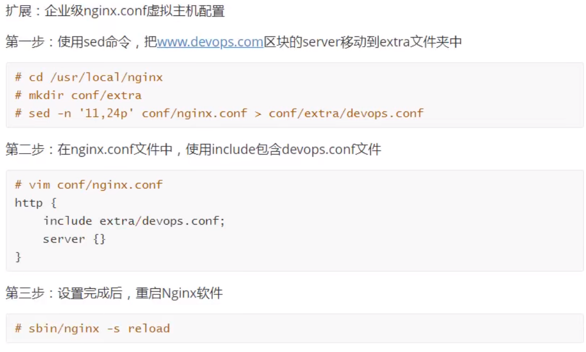
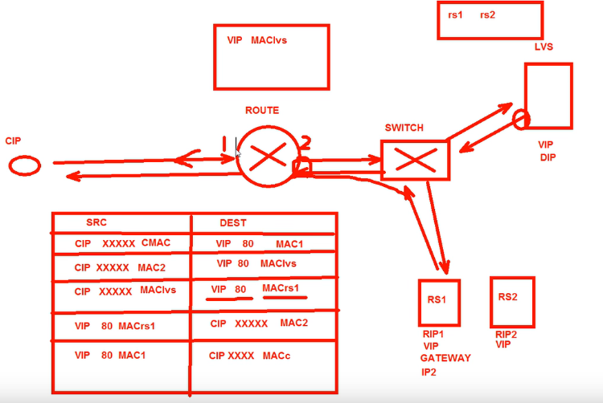
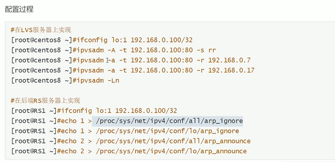
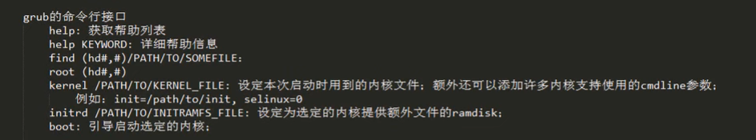
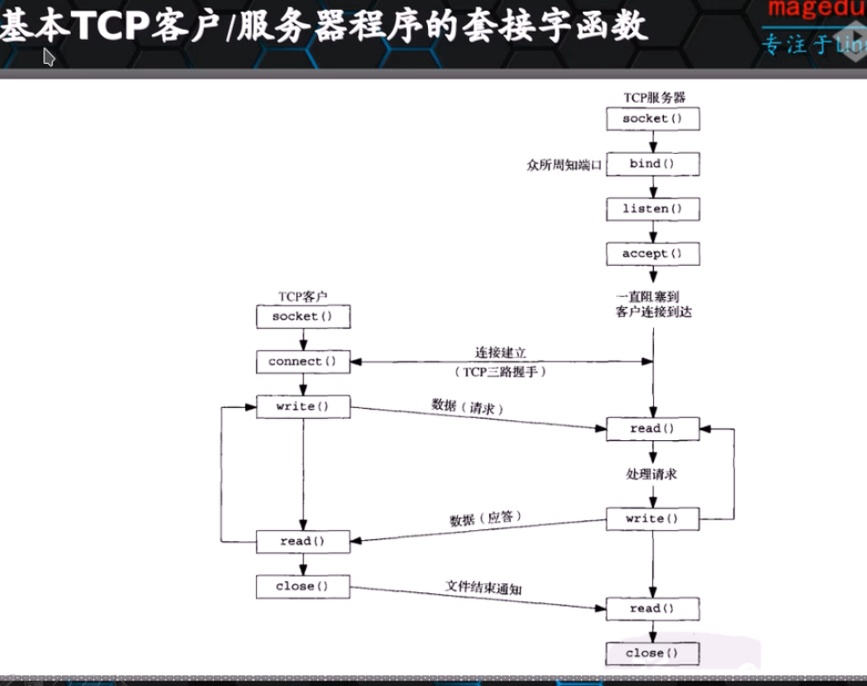

[IT运维知识图谱](https://blog.csdn.net/yolo2016/article/details/121313726)

#  专业技能
## 运维支持
###  操作系统
[Linux 系统架构](https://blog.csdn.net/yolo2016/article/details/121985958)
[Linux系统裁剪与定制](https://blog.csdn.net/yolo2016/article/details/123612204)
[Linux系统grub损坏修复案例](https://blog.csdn.net/yolo2016/article/details/123609829)
[Linux系统进程及作业管理](https://blog.csdn.net/yolo2016/article/details/123563804)

[Linux 内核以及伪文件系统](https://blog.csdn.net/weixin_44983653/article/details/94732559)

[Centos7新特性-systemd及systemctl实践](https://blog.csdn.net/weixin_44983653/article/details/97780657)

[Linux下find，grep，sed，awk命令解析](https://blog.csdn.net/yolo2016/article/details/121675150)

[文件共享方式](https://blog.csdn.net/yolo2016/article/details/121604337)
[Linux下文件共享——NFS搭建](https://blog.csdn.net/yolo2016/article/details/121426323)
[Linux命令大全](https://blog.csdn.net/yolo2016/article/details/114294998)
[Linux命令grep实现精确匹配](https://blog.csdn.net/yolo2016/article/details/113851321)
[Linux下服务的创建以及开机启动](https://blog.csdn.net/yolo2016/article/details/122283219)
[Raid技术](https://blog.csdn.net/yolo2016/article/details/121986215)
[Windows下的hiberfil.sys文件及其作用](https://blog.csdn.net/yolo2016/article/details/114916740)

[PXE + KS 实现系统自动部署系统](https://blog.csdn.net/weixin_44983653/article/details/102539178)

[PXE实现系统批量自动安装](https://blog.csdn.net/yolo2016/article/details/118059071)

[linux系统shell 基础](https://blog.csdn.net/yolo2016/article/details/123807982)

[Shell脚本完成Linux系统的初始化配置](https://blog.csdn.net/yolo2016/article/details/115793985)

[Linux 系统常见FAQ](https://blog.csdn.net/yolo2016/article/details/115517353)

[Linux 特殊权限](https://blog.csdn.net/yolo2016/article/details/126849645)

[Windows下DOS/BAT实现服务的重启](https://blog.csdn.net/yolo2016/article/details/124935449)

[逻辑卷扩容管理](https://blog.csdn.net/yolo2016/article/details/124650145)

### 云原生

[云计算](http://c.biancheng.net/view/3769.html)

[kubernetes实践](https://blog.csdn.net/yolo2016/article/details/121986135)
[Docker](https://blog.csdn.net/yolo2016/article/details/121985660)

[Devops项目实践](https://blog.csdn.net/yolo2016/article/details/126325222)

[云原生FAQ](https://blog.csdn.net/yolo2016/article/details/126059703)
[HPC系统简介](https://blog.csdn.net/yolo2016/article/details/126048515)
[harbor镜像仓库](https://blog.csdn.net/yolo2016/article/details/125762565)
[Deops入门](https://blog.csdn.net/yolo2016/article/details/125577119)
[云原生资料汇总](https://blog.csdn.net/yolo2016/article/details/125154437)
[kubernetes中service与ingress](https://blog.csdn.net/yolo2016/article/details/125137910)

[Docker容器异常定位](https://blog.csdn.net/yolo2016/article/details/124831550)
[Linux系统防火墙](https://blog.csdn.net/yolo2016/article/details/124831383)
[Kubernets的资源管理](https://blog.csdn.net/yolo2016/article/details/124773604)
[Docker 常用命令](https://blog.csdn.net/yolo2016/article/details/124764063)
[Rancher实践](https://blog.csdn.net/yolo2016/article/details/124762973)


### 网络
[Linux系统网络管理](https://blog.csdn.net/yolo2016/article/details/123384376)
[IP地址规划](https://blog.csdn.net/yolo2016/article/details/122971488)
[图解网络TCP/IP](https://blog.csdn.net/yolo2016/article/details/121986094)

[网络安全应知应会篇](https://blog.csdn.net/yolo2016/article/details/124654301)

[网络安全-ARP欺骗攻击原理与实践](https://blog.csdn.net/yolo2016/article/details/124438795)


### 服务应用
[LDAP服务](https://blog.csdn.net/yolo2016/article/details/121721723)
[DNS服务](https://blog.csdn.net/yolo2016/article/details/121711220)
[HAProxy技术实践](https://blog.csdn.net/yolo2016/article/details/123493033)
[常用webserver 比较](https://blog.csdn.net/yolo2016/article/details/123538125)
[LVS技术实践](https://blog.csdn.net/yolo2016/article/details/122903957)
[Keepalived 高可用集群的使用](https://blog.csdn.net/yolo2016/article/details/122790691)

[httpd实践](https://blog.csdn.net/yolo2016/article/details/123878927?spm=1001.2014.3001.5501)

[nginx 常用配置模板](https://blog.csdn.net/yolo2016/article/details/126318617)

[LNMP环境搭建](https://blog.csdn.net/yolo2016/article/details/122759542)

[通过frp实现云服务器外网穿透访问内网](https://blog.csdn.net/yolo2016/article/details/123916831)


### 数据库

[Mysql主从复制](https://blog.csdn.net/yolo2016/article/details/123038000)
[Mysql中 root密码忘记处理方式](https://blog.csdn.net/yolo2016/article/details/123037354)
[Mysql之权限操作](https://blog.csdn.net/yolo2016/article/details/122870595)
[Mysql之索引](https://blog.csdn.net/yolo2016/article/details/122869901)
[Mysql之存储过程及函数](https://blog.csdn.net/yolo2016/article/details/122869873)
[Mysql之视图](https://blog.csdn.net/yolo2016/article/details/122869671)
[Mysql之事务](https://blog.csdn.net/yolo2016/article/details/122831685)
[Mysql备份——mysqldump](https://blog.csdn.net/yolo2016/article/details/122812747)
[Mysql使用FAQ](https://blog.csdn.net/yolo2016/article/details/115821769)
[Redis 基础实践](https://blog.csdn.net/yolo2016/article/details/123450333)
[Redis高级实践](https://blog.csdn.net/yolo2016/article/details/123510463)
[数据库中查询Top数据和去重的方法](https://blog.csdn.net/yolo2016/article/details/115334986)
[Oracle数据库安装以及SQL命令的使用](https://blog.csdn.net/yolo2016/article/details/115196266)


### 自动化
[Saltstack](https://blog.csdn.net/yolo2016/article/details/121313710)
[Ansible](https://blog.csdn.net/yolo2016/article/details/121311139)

### 监控
[监控工具——Prometheus](https://blog.csdn.net/yolo2016/article/details/121313718)
[Zabbix监控实践](https://blog.csdn.net/yolo2016/article/details/121313700)

### python编程
[python常见问题FAQ总结](https://blog.csdn.net/yolo2016/article/details/114117041)
[python爬虫实战：爬取我的博客文章并将文章写入至我的Mysql数据库](https://blog.csdn.net/yolo2016/article/details/114270877)

[python中如何生成项目帮助文档](https://blog.csdn.net/yolo2016/article/details/114124879)
[python中利用*args,**kwargs来表示函数动态长度参数](https://blog.csdn.net/yolo2016/article/details/114116615)
[分享一个好的Python爬虫学习材料](https://blog.csdn.net/yolo2016/article/details/113851091)
[Django架构中MVC模式的解析](https://blog.csdn.net/yolo2016/article/details/113850717)


### 代码库
[常用代码参考模板](https://blog.csdn.net/yolo2016/article/details/118054873)

[Github](https://github.com/yangle92) 

[gitee.com](https://gitee.com/yangle92)

## 通用技能
### PMP
[项目管理资料包汇总](https://blog.csdn.net/yolo2016/article/details/116517512)

### ITIL

[ITIL框架结构剖析](https://blog.csdn.net/yolo2016/article/details/113849521)

### Others

[高效能人士的七个习惯的简要定义与架构图](https://blog.csdn.net/yolo2016/article/details/113824372)
[如何成为一名优秀的企业管理者](https://blog.csdn.net/yolo2016/article/details/88082008)

[3+1活动：结交一个朋友、参与一项运动 、培养一个兴趣爱好 、阅读一本好书](https://blog.csdn.net/yolo2016/article/details/114294240)


# ############LNMP############# ###########

## LNMP

<<<<<<< HEAD

=======

>>>>>>> 23ba4f9 (update)


1. 用户访问域名网站，DNS解析成对应的IP
2. IP：80 端口，访问到WebServer Nginx，如果是静态目录，Nginx直接将请求返回给用户端
3. 如果是动态PHP文件，Nginx会将PHP文件转发给PHP-FPH PHP核心解析器，同时，解析器对PHP代码进行解析，如果涉及到数据库操作类的动作，会和数据库作交互。 最后将解析后的PHP代码返回给Nginx，Nginx最后将结果再呈现给用户。


linux

nginx

mysql

php-fpm 

## 服务器环境准备


配置IP地址与UUID编号

更改主机名

绑定IP与主机名称到/etc/hosts文件中

关闭防火墙Selinux

关闭NetworkManager

时间同步

配置yum源

```powershell
systemctl stop firewalld
systemctl disable firewalld
setenforce 0
sed -i  's/SELINUX=enforcing/SELINUX=disabled/g' /etc/selinux/config 
systemctl stop NetworkManager
systemctl disable NetworkManager
ntpdate cn.ntp.org.cn
```


## Mysql安装

GLIBC安装：操作简单，部署方便 （推荐）

源码安装：1）定制性强 2）安装耗时


使用Shell安装

后续配置 设置安全，安全策略

**mysql_secure_installation**

mysql -h ip -p 3306 -uroot -proot

扩展mysql.service 


## Nginx服务


webServer一种 :IIS Apach Nginx

Nginx ： 稳定高效并发量高，

安装方式  yum  源码安装

源码 安装步骤：配置+编译+安装


UdRg!Jp%%4ly  

```powershell
#1)安装nginx
wget http://nginx.org/packages/centos/7/noarch/RPMS/nginx-release-centos-7-0.el7.ngx.noarch.rpm
rpm -ivh nginx-release-centos-7-0.el7.ngx.noarch.rpm
yum -y install nginx
systemctl start nginx
systemctl enable nginx
systemctl status nginx.service

#2)安装MySql
wget -i -c http://dev.mysql.com/get/mysql57-community-release-el7-10.noarch.rpm
yum -y install mysql57-community-release-el7-10.noarch.rpm
yum makecache
yum -y install mysql-community-server
systemctl start mysqld
systemctl enable mysqld
systemctl status mysqld.service
    # 执行以下命令，获取安装MySQL时自动设置的root用户密码。
    grep 'temporary password' /var/log/mysqld.log
	#回显如下类似信息。
#加固MySql并且设置安全策略
mysql_secure_installation

           
            [ host201:~ ]# mysql_secure_installation

            Securing the MySQL server deployment.

            Enter password for user root:

            The existing password for the user account root has expired. Please set a new password.

                        New password:

            Re-enter new password:
            The 'validate_password' plugin is installed on the server.
            The subsequent steps will run with the existing configuration
            of the plugin.
            Using existing password for root.

            
            Estimated strength of the password: 100
            Do you wish to continue with the password provided?(Press y|Y for Yes, any other key for No) : y
            By default, a MySQL installation has an anonymous user,
            allowing anyone to log into MySQL without having to have
            a user account created for them. This is intended only for
            testing, and to make the installation go a bit smoother.
            You should remove them before moving into a production
            environment.

            Remove anonymous users? (Press y|Y for Yes, any other key for No) : y
            Success.


            Normally, root should only be allowed to connect from
            'localhost'. This ensures that someone cannot guess at
            the root password from the network.

            Disallow root login remotely? (Press y|Y for Yes, any other key for No) : n

             ... skipping.
            By default, MySQL comes with a database named 'test' that
            anyone can access. This is also intended only for testing,
            and should be removed before moving into a production
            environment.


            Remove test database and access to it? (Press y|Y for Yes, any other key for No) : n

             ... skipping.
            Reloading the privilege tables will ensure that all changes
            made so far will take effect immediately.

            Reload privilege tables now? (Press y|Y for Yes, any other key for No) : y
            Success.

            All done!

	#数据库登录	
		 mysql -uroot -pHuawei12#$
		 mysq	-h 192.168.3.50 -P 3306 -uroot -proot

#3 安装PHP
rpm -Uvh https://mirror.webtatic.com/yum/el7/epel-release.rpm
rpm -Uvh https://mirror.webtatic.com/yum/el7/webtatic-release.rpm
yum -y install php70w-tidy php70w-common php70w-devel php70w-pdo php70w-mysql php70w-gd php70w-ldap php70w-mbstring php70w-mcrypt php70w-fpm
php -v

systemctl start php-fpm
systemctl enable php-fpm

# 4 修改nginx 配置，让webserver nginx 能识别index.php文件，从而将php动态代码转发给PHP-FPM  PHP解析器能
vim /etc/nginx/nginx.conf

[ host201:/etc/nginx ]# cat nginx.conf

user  nginx;
worker_processes  auto;

error_log  /var/log/nginx/error.log notice;
pid        /var/run/nginx.pid;


events {
    worker_connections  1024;
}


http {
    include       /etc/nginx/mime.types;
    default_type  application/octet-stream;

    log_format  main  '$remote_addr - $remote_user [$time_local] "$request" '
                      '$status $body_bytes_sent "$http_referer" '
                      '"$http_user_agent" "$http_x_forwarded_for"';

    access_log  /var/log/nginx/access.log  main;

    sendfile        on;
    #tcp_nopush     on;

    keepalive_timeout  65;

    #gzip  on;

    include /etc/nginx/conf.d/*.conf;
}

[ host201:/etc/nginx/conf.d ]# cat nginx.conf  | grep -Ev '^$|#'
server {
    listen       80;
    server_name  localhost;
    location / {
        root   /usr/share/nginx/html;
        index  index.html index.htm;
    }
    error_page   500 502 503 504  /50x.html;
    location = /50x.html {
        root   /usr/share/nginx/html;
    }
    location ~ \.php$ {
        root           /usr/share/nginx/html;
        fastcgi_pass   127.0.0.1:9000;
        fastcgi_index  index.php;
        fastcgi_param  SCRIPT_FILENAME  $document_root$fastcgi_script_name;
        include        fastcgi_params;
    }
}

```


* nginx 部署成功 验证 80端口 


* PHP-FPM 部署成功 


##  安装参考link 


https://support.huaweicloud.com/bestpractice-ecs/zh-cn_topic_0130142475.html

一键安装

phpstudy

lnmp.org


## Nginx平滑升级


access.log error.log


## Nginx.conf核心配置文件


## 虚拟主机的配置（server区块）


###  扩展 




##  数据库分离


# ###SSL


# ######Keepalived###############


## HA高可用服务的搭建

HighAvailable


###  keepalived

#### Keepalived介绍

Keepalived 软件起初是专为 LVS 负载均衡软件设计的，用来管理并监控 LVS 集群系统中各个服务节点的状态，后来又加入了可以实现高可用的 VRRP 功能。因此，Keepalived除了能够管理 LVS 软件外，还可以作为其他服务（例如：Nginx、Haproxy、MySQL等）的高可用解决方案软件。

Keepalived 软件主要通过 VRRP 协议实现高可用功能的，VRRP 是 Virtual Router Redundancy Protocol （虚拟路由器冗余协议）的缩写，VRRP 出现的目的就是为了解决动态路由单点故障问题的，它能够保证当个别节点宕机时，整个网络可以不间断的运行。所以，Keepalived 一方面具有配置管理 LVS 的功能，同时还具有对LVS 下面节点进行健康检查的功能，另一方面也可以实现系统网络服务的高可用功能。

Keepalived 软件的官方站点： [http://www.keepalived.org](http://www.keepalived.org/)


#### Keepalived 服务的三个重要功能

**1）管理 LVS 负载均衡软件**

早期的 LVS 软件，需要通过命令行或脚本实现管理，并且没有针对 LVS 节点的健康检查功能。为了解决 LVS 的这些使用不便的问题，Keepalived就诞生了，可以说，Keepalived软件起初是专为了解决 LVS 的问题而诞生的。因此，Keepalived和LVS的感情很深，它们的关系如同夫妻一样，可以紧密的结合，愉快的工作。Keepalived 可以通过读取自身的配置文件实现通过更底层的接口直接管理 LVS 的配置以及控制服务的启动、停止等功能，这使得 LVS 的应用就更加简单方便了。

**2）实现对 LVS 集群节点健康检查功能（healthcheck）**

Keepalived 可以通过在自身的keepalived.conf文件里配置 LVS 的节点 IP 和相关参数实现对 LVS 的直接管理；除此之外，当 LVS 集群中的某一个甚至是几个节点服务器同时发生故障无法提供服务时，Keepalived 服务会自动将失效的节点服务器从 LVS 的正常转发队列中清楚出去，并转换到别的正常节点服务器上，从而保证最终用户的访问不受影响；当故障的节点服务器被修复后，Keepalived 服务又会自动地把它们加入到正常转发队列中，对客户提供服务。

**3）作为系统网络服务的高可用功能（failover）**

Keepalived 可以实现任意两台主机之间，例如 Master 和 Backup 主机之间的故障转移和自动切换，这个主机可以是普通的不能停机的业务服务器，也可以是 LVS 负载均衡、Nginx 反向代理这样的服务器。

Keepalived 高可用功能实现的原理为：两台主机同时安装好 keepalived 软件并启动服务，开始正常工作时，由角色为 Master 的主机获得所有资源并对用户提供服务，角色 Backup 的主机作为 Master 主机的热备；当角色为 Master 的主机失效或出现故障时，角色为 Backup 的主机将自动接管 Master 主机的所有工作，包括接管 VIP 资源及相应资源服务；而当角色为 Master 的主机故障修复后，又会自动接管回它原来处理的工作，角色为 Backup 的主机则同时释放 Master 主机失效它接管的工作，此时，两台主机将恢复到最初启动时各自的原始角色及工作状态。


#### Keepalived 高可用故障切换转移原理（重点）
Keepalived 高可用服务对之间的故障切换转移，是通过 VRRP 协议（虚拟路由冗余协议）来实现的。

在 Keepalived 服务正常工作时，主 Master 节点会不断地向备节点发送（多播的方式）心跳消息，用以告诉备 Backup 节点自己还活着，当主 Master 节点发生故障时，就无法发送心跳消息了，备节点也就因此无法继续检测到来自Master 节点的心跳了，进而调用自身的接管程序，接管主 Master 节点的 IP 资源及服务。而当主 Master 节点恢复时，备 Backup 节点又会释放主节点故障时自身接管的 IP 资源及服务，恢复到原来备用角色。

#### 扩展
区分广播，组播和单播的区别

```powershell
yum install keepalived
service keepalived start
systemctl keepalived enable
```


**Master 配置 **

state MASTER/BACKUP

virtual_router_id  虚拟路由ID要保持一致

priority 越大优先级越高

virtual_ipaddress  虚拟IP


```powershell
[ host200:/etc/keepalived ]# ls
keepalived.conf
[ host200:/etc/keepalived ]# cat keepalived.conf
! Configuration File for keepalived

global_defs {
   notification_email {
     acassen@firewall.loc
     failover@firewall.loc
     sysadmin@firewall.loc
   }
   notification_email_from Alexandre.Cassen@firewall.loc
   smtp_server 192.168.200.1
   smtp_connect_timeout 30
   router_id LVS_DEVEL
   vrrp_skip_check_adv_addr
   vrrp_strict
   vrrp_garp_interval 0
   vrrp_gna_interval 0
}

vrrp_instance VI_1 {
    state MASTER
    interface ens33
    virtual_router_id 51
    priority 100
    advert_int 1
    authentication {
        auth_type PASS
        auth_pass 1111
    }
    virtual_ipaddress {
        192.168.3.150
    }
}

```

Backup配置

```powershell
[ host201:/usr/share/nginx/html ]# cd /etc/keepalived/
[ host201:/etc/keepalived ]# cat keepalived.conf
! Configuration File for keepalived

global_defs {
   notification_email {
     acassen@firewall.loc
     failover@firewall.loc
     sysadmin@firewall.loc
   }
   notification_email_from Alexandre.Cassen@firewall.loc
   smtp_server 192.168.200.1
   smtp_connect_timeout 30
   router_id LVS_DEVEL
   vrrp_skip_check_adv_addr
   vrrp_strict
   vrrp_garp_interval 0
   vrrp_gna_interval 0
}

vrrp_instance VI_1 {
    state BACKUP
    interface ens33
    virtual_router_id 51
    priority 90
    advert_int 1
    authentication {
        auth_type PASS
        auth_pass 1111
    }
    virtual_ipaddress {
        192.168.3.150
    }
}
```


**让keepalived监测Nginx服务 **

原因： 由于Keepalive 虚IP的漂移的前提1） 网络不通，系统宕机  2） keepalived 进程异常，所以当nginx服务异常时，keepalive的VIP不会随之漂移，故需要编写脚本，让VIP进行迁移

```powershell
#!/bin/bash
nginx_status=`ps -C nginx --no-header | wc -l`
if [ $nginx_status -eq 0 ]; then
	service keepalived stop
fi

```


#### 非抢占模式配置


#### VIP脑裂

脑裂(split-brain): 指在一个高可用(HA)系统中，当联系着的两个节点断开联系时，本来为一个整体的系统，分裂成两个独立节点，这时两个节点开始争抢共享资源，结果会导致系统混乱，数据损坏。(Master-Backup，两台机器上同时拥有VIP)

```powershell
#抓包软件tcpdump
yum install tcpdump -y 
tcpdump -i ens33 vrrp -n 

#  master是如何发送组播数据包
#  master服务器-->组播地址发送数据包-->backup服务器 
# 当有一天，Backup接受不到组播地址发送过来的数据包，系统就会认为Master宕机，开始选出生成新的Master。
# VIP脑裂最大的原因就是防火墙未关闭或者没有把VRRP协议添加到防火墙中。
# 发生脑裂如何处理
#  1） 抓包+查看vip  2） 关闭backup的keepalived软件  3） 检查防火墙 4)启动keepalived软件
## 3.1测试环境
		systemctl stop firewalld
## 3.2生成环境
		firewall-cmd --direct --permanent --add-rule ipv4 filter INPUT 0 --in-interface ens33 --destination [广播IP地址] --protocol  vrrp -j  ACCEPT
		firewall-cmd --reload
```


#### 单播模式

组播模式的弊端：1） 产生众多无用的信息，干扰和冲突，2）消耗带宽  3）云服务禁止组播

组播改单播配置

1) keepalivd1.3以上版本，注释vrrp_strict

2)

**Master配置**

```powershell
vrrp_instance VI_1 {
    state BACKUP
    nopreempt
    interface ens33
    virtual_router_id 51
    priority 100
    advert_int 1
    track_script {
        check_nginx
        }
    authentication {
        auth_type PASS
        auth_pass 1111
    }
    virtual_ipaddress {
        192.168.3.150
    }
    unicast_src_ip 192.168.3.200
    unicast_peer {
        192.168.3.201
        }
}
```


**BACKUP配置**

```powershell
! Configuration File for keepalived

global_defs {
   notification_email {
     acassen@firewall.loc
     failover@firewall.loc
     sysadmin@firewall.loc
   }
   notification_email_from Alexandre.Cassen@firewall.loc
   smtp_server 192.168.200.1
   smtp_connect_timeout 30
   router_id LVS_DEVEL
   vrrp_skip_check_adv_addr
#   vrrp_strict
   vrrp_garp_interval 0
   vrrp_gna_interval 0
}

vrrp_script check_nginx {
        script /sysadmin/manager/LNMP/nginx.sh
        interval 3
}

vrrp_instance VI_1 {
    state BACKUP
    nopreempt
    interface ens33
    virtual_router_id 51
    priority 90
    advert_int 1
    track_script {
        check_nginx
        }
    authentication {
        auth_type PASS
        auth_pass 1111
    }
    virtual_ipaddress {
        192.168.3.150
    }
    unicast_src_ip 192.168.3.201
    unicast_peer {
        192.168.3.200
        }

}

```


# #####Mysql#####################

# Mysql

###  基础

#### 索引

```sql
create user  'user1'@localhost identified by 'passwd123';
create user   'user1'@% identified by 'passwd123';
grant all on *.* to 'user1'@localhost identified by 'passwd123';
drop user  'user1'@localhost;
delete from mysql.user where user='user1' AND host='localhost';
rename user 'old_user'@localhost to 'new_user'@localhost;
#flush privilages; //刷新权限
mysqladmin -uroot -p'root' password 'new_password'
alter user user1'@% identified by 'passwd123';
set password=password('newpassword');

#root密码忘记，如何登录mysql
# https://cloud.tencent.com/developer/article/1855931
```

###  事务

### 视图

#### 什么是视图

1. 视图是一个虚拟的表，其内容由查询定义。
2. 同真实的表一样，视图包含一系列带有名称的列和行数据。
3. 行和列数据来自定义视图的查询所引用的表，并且在引用视图时动态生成。
4. 简单的来说视图是由select结果组成的表。

#### 视图的特性

1. 视图是对若干张表的引用，一张虚表，查询语句执行的结果。
2. 不存储具体数据（基本表数据发生了改变，视图也会跟着改变）；
3. 可以跟基本表一样，进行增删改查操作（增删改查操作有条件限制）

#### 视图的作用

1. 安全性：创建一个视图，定义好该视图所操作的数据。之后将用户权限与视图绑定。这样的方式是使用到了一个特性，grant语句可以针对视图进行授予权限。
2. 查询性能提高
3. 提高了数据的独立性。

#### 视图的操作

```sql

//创建视图
CREATE VIEW v1 AS (SELECT * from employees WHERE salary >10000)
select * from v1
//删除视图
drop view v2

//修改视图
CREATE  or REPLACE VIEW v1 AS (SELECT * from employees WHERE salary >10000)

//查看视图结构
select * from v1
desc v1
show CREATE view v1


//视图语法 CREATE [ALGORITHM]={UNDEFINED| MERGE| TEMPTABLE }] VIEW 视图名[(属性清单)]
// AS SELECT 语句 [WITH [CASCADED|LOCAL] CHECK OPTION];
// MERGE 处理方式替换式，可以进行更新真实表中的数据
// TEMPTABLE 具体式，由于数据存储在临时表中，所以不可以进行数据更新操作
// UNDEFINED 没有定义ALGORITHM参数，mysql更倾向选择替换方式，因为更高效
// WITH  CHECK OPTION  更新数据时不能插入或者更新不符合试图限制条件的记录
// CASCADED|LOCAL 为可选参数，决定了检查测试的范围，默认为CASCADED


CREATE ALGORITHM=UNDEFINED 
DEFINER=`root`@`%` 
SQL SECURITY DEFINER VIEW `v1` 
AS 
(select `employees`.`employee_id` AS `employee_id`,
`employees`.`first_name` AS `first_name`,
`employees`.`last_name` AS `last_name`,`employees`.`email` AS `email`,
`employees`.`phone_number` AS `phone_number`,`employees`.`job_id` AS `job_id`,
`employees`.`salary` AS `salary`,
`employees`.`commission_pct` AS `commission_pct`,
`employees`.`manager_id` AS `manager_id`,
`employees`.`department_id` AS `department_id`,
`employees`.`hiredate` AS `hiredate` 
from `employees` 
where (`employees`.`salary` > 10000))
```


#### 试图不可更新的部分


### Mysql主从复制


### Mysqldump

mysqldump 备份出的文件就是 sql 文件，其核心就是对每个表执行 select ，然后转化成相应的 insert 语句。

mysqldump 的备份流程大致如下：

1. 对某个库下所有表加读锁；
2. 循环备份备份表数据；
3. 释放读锁；
4. 循环上面三个步骤；
5. 备份完毕。


#### 一. mysqldump命令备份数据

在MySQL中提供了命令行导出数据库数据以及文件的一种方便的工具**mysqldump**,我们可以通过命令行直接实现数据库内容的导出dump,首先我们简单了解一下mysqldump命令用法:

```powershell
#MySQLdump常用
mysqldump -u root -p --databases 数据库1 数据库2 > xxx.sql
```


####  二. mysqldump常用操作示例
```powershell
#1. 备份全部数据库的数据和结构
mysqldump -uroot -p123456 -A > /data/mysqlDump/mydb.sql


#2.备份全部数据库的结构（加 -d 参数）
mysqldump -uroot -p123456 -A -d > /data/mysqlDump/mydb.sql


#3. 备份全部数据库的数据(加 -t 参数)
mysqldump -uroot -p123456 -A -t > /data/mysqlDump/mydb.sql


#4.备份单个数据库的数据和结构(,数据库名mydb)
mysqldump -uroot-p123456 mydb > /data/mysqlDump/mydb.sql

#5. 备份单个数据库的结构
mysqldump -uroot -p123456 mydb -d > /data/mysqlDump/mydb.sql


#6. 备份单个数据库的数据
mysqldump -uroot -p123456 mydb -t > /data/mysqlDump/mydb.sql


#7. 备份多个表的数据和结构（数据，结构的单独备份方法与上同）
mysqldump -uroot -p123456 mydb t1 t2 > /data/mysqlDump/mydb.sql


#8. 一次备份多个数据库
mysqldump -uroot -p123456 --databases db1 db2 > /data/mysqlDump/mydb.sql
```


####  三. 还原 MySQL备份内容

有两种方式还原，第一种是在 MySQL 命令行中，第二种是使用 SHELL 行完成还原
```powershell
#1. 在系统命令行中，输入如下实现还原：
mysql -uroot -p123456 < /data/mysqlDump/mydb.sql

#2. 在登录进入mysql系统中,通过source指令找到对应系统中的文件进行还原：
mysql> source /data/mysqlDump/mydb.sql
```


###  


## Mycat


## FAQ

curl -I  http:localhost   获取头部信息


# ######LVS#######################


## LVS


### 名称解释

| 名称        | 缩写 | 说明                                                    |
| :---------- | ---- | ------------------------------------------------------- |
| 虚拟IP      | VIP  | Virtual IP address ，域名解析的IP地址                   |
| 真实IP      | RIP  | real  server IP address，在集群下面节点上使用的IP地址   |
| Director IP | DIP  | Director IP Address，用于连接内外网络，即物理卡的IP地址 |
| 客户端IP    | CIP  | Client ip address ，客户端请求集群服务的IP地址          |
| 真实服务器  | RS   | real server                                             |
| VS          | vs   | virtual server                                          |

访问流程  CIP <--> VIP==DIP <---> RIP

### LVS 的组成及作用


**LVS 由两部分程序组成，包括 ipvs 和 ipvsadm**

1. `ipvs`(ip virtual server)：LVS 是基于内核态的 netfilter 框架实现的 IPVS 功能，工作在内核态。用户配置 VIP 等相关信息并传递到 IPVS 就需要用到 ipvsadm 工具。
2.  `ipvsadm`：ipvsadm 是 LVS 用户态的配套工具，可以实现 VIP 和 RS 的增删改查功能，是基于 netlink 或 raw socket 方式与内核 LVS 进行通信的，如果 LVS 类比于 netfilter，那 ipvsadm 就是类似 iptables 工具的地位。

**作用**

- 主要用于多服务器的负载均衡；
- 工作在网络层，可实现高性能，高可用的服务器集群技术；
- 廉价，可把许多低性能的服务器组合在一起形成一个超级服务器；
- 易用，配置简单，有多种负载均衡的方法；
- 稳定可靠，即使在集群的服务器中某台服务器无法正常工作，也不影响整体效果；
- 可扩展性好；

### LVS 四种工作模式

1. 网络地址倒换 NAT （Network Address Translation）---支持端口映射

   

   

2. 直连路由模式，DR （Director Routing）--不支持端口映射

   

3. IP 隧道模式，即TUN模式  （IP Tunneling）

4. 完全网络地址转换模式，即FULLNAT模式（FULL Network Address Translation）


```powershell
  --gatewaying   -g                   gatewaying (direct routing) (default)
  --ipip         -i                   ipip encapsulation (tunneling)
  --masquerading -m                   masquerading (NAT)
```


### 调度算法

Director调度器可用于做出该决定的调度方法分成两个基本类别：

- 固定调度算法：rr,wrr,dh,sh

- 动态调度算法：wlc,lc,lblc,lblcr,SED,NQ

  


### 软件安装

```powershell
yum install ipvsadm -y
rpm -qa ipvsadm   #ipvsadm-1.27-8.el7.x86_64
modprobe ip_vs    #把ipvs加入到内核
lsmod|grep ip_vs  #检查内核是否有ip_vs
uname -r          #3.10.0-1160.31.1.el7.x86_64
ln -s /usr/src/kernels/3.10.0-1160.31.1.el7.x86_64 /usr/src/linux  #yum install kernel-devel -y
ls -l /usr/src/
#lrwxrwxrwx  1 root root 44 8月   1 18:04 linux -> /usr/src/kernels/3.10.0-1160.31.1.el7.x86_6
特别注意：
1)ln命令链接路径要和uname -r输出结果内核版本对应。
2)如果没有/usr/src/kernels/xx路径,可通过yum install kernel-devel -y安装。
```


### NAT （支持端口映射）


hostnamectl 


iptables -vnL

ipvsadm -vnL


三种工作模式


ipvsadmn -Ln


cat  /proc/net/ip_vs

route -n


### DR （不支持端口映射）




请求报文经过LVS  响应不经过


路由器确认端口转发

-g dr模型





LVS需要配置网关，但是网关错误也可以


curl -k 忽略证书检查


DR模型特点

1DIrector和各RS都配置VIP

2 确保前端路由器将目标IP为VIP的请求报文发给Director

​	在前端网关做静态绑定VIP和Director的MAc地址

​	在RS上使用arptables工具

```powershell
arptables -A IN -d $VIP -j DROP
arptables -A OUT -s $VIP 0j mangle --mangle-ip-s $RIP
```


在RS上修改内核参数以限制arp通告及应答级别

```powershell
/proc/sys/net/ip4/conf/all/arp_ignore
/proc/sys/net/ip4/conf/all/arp_announce
```


3 RS的RIP可以使用私网地址，也可以使用公网地址，RIP与DIP在同一IP网络；RIP的网关不能指向DIP，以确保响应报文不会经过Director

4 RS和Director要在同一个物理网络

5请求报文要经过Director，响应报文不经过Director，而是由RS直接发往Client

6不支持端口映射（端口不能修改）

7 RS可使用大多数OS系统

###  Tunnel


### FullNAT


默认内核不支持


### 标签与持久性


### 健康检查

idrectord

keepalived


### 参考

https://mp.weixin.qq.com/s/3Ahb299iBScC3Znrc7NUNQ


# #####Linux基础###############


## umask

权限掩码

0022

0 附加权限 set uid set gid

022    777-022=755

umask 077 

与用户创建目录的默认权限有关


## 存储

DAS 直连存储 ide线， sata线，sas线

NAS 网络附件存储 samba nfs ftp 文件系统

SAN 存储区域网络  iscsi    块

SDS 软件定义存储  ceph glusterfs

### 分布式文件系统

Lustre

Hadoop

FastDFS

Ceph

GlusterFS


取余

切片

ceph默认有3副本

制作yum 源 需要rpm包后需要createrepo 生成repodata数据才能生成yum源  https://www.cnblogs.com/xbroad/p/11983333.html

自动部署ceph集群   ceph-deploy


磁盘分区


存储池 --》 镜像

cow 快照

rbd  showmapped


快照

克隆


# 计算机组成

五大单元

输入

输出

中央处理器（CPU）

CPU为一个具有特定功能的芯片，里面含有微指令集。 CPU内可分为两个单元，算术逻辑单元与控制单元

算术逻辑单元：程序运算与逻辑判断

控制单元主要协调各组件与各单元的工作


#  网络

静态路由

动态路由 rip ospf


## 命令行提示
ip address add, delete and show (or list ) 

 ip address { add | change | replace } IFADDR dev IFNAME [ LIFETIME ] [ CONFFLAG-LIST ]


Cenotos6
system-config-network
setup

Centos7
nmtui


## 基于配置文件

- 网卡配置文件

/etc/sysconfig/network-script/ifcfg-IFACE

如需要给一个接口配置多个地址

```shell
1）ifconfig eth1:0 192.168.20.100/24 (重启网卡失效)
2） 配置文件 cp eth1 eth1:0  后进行修改	
	DEVICE=IFACE_LABLE
	BOOTPORTO：网上别名不支持动态获取IP地址，需要配置为[static|none]
```

- 网卡路由配置
  /etc/sysconfig/network-scripts/route-IFACE

  1) 每行一条路由条目
  	TARGET via GW
  2) 每三行一个路由条目
  	ADDRESS=TARGET
  	NETMASK=MASK
  	GATEWAY=NextHop

- 网络服务	

  network

  NetworkManager (不完善，建议服务禁用掉，使用network)

  Centos6 :  service SERVICE {start|stop| restart| status}

  Centos7: systemctl  {start|stop| restart| status} SERVICE[.service]

  当配置文件修改后需要重启网络服务才使之生效

  service network restart

  systemctl restart network.service


​	

## nmcli

nmcli - command-line tool for controlling NetworkManager
 nmcli [OPTIONS...] {help | general | networking | radio | connection | device | agent | monitor} [COMMAND]  [ARGUMENTS...]

Usage: nmcli [OPTIONS] OBJECT { COMMAND | help }

 nmcli  device 


```shell
网络用户
本地用户

ldap图形配置工具authconfig-gtk

网卡链路聚合
设置一个虚拟网卡
nmcli connection add type team ifname team0 con-name team0 autoconnect yes config '{"runner": {"name": "activebackup"}}'
添加成员
nmcli connection add type team-slave ifname eth1 con-name team0-1  autoconnect yes master team0
nmcli connection add type team-slave ifname eth2 con-name team0-2  autoconnect yes master team0
为虚拟网卡设置IP地址
IP地址与子网掩码
nmcli connection modify team0 ipv4.method manual ipv4.address 192.168.1.1/24 connection.autoconnect yes
nmcli connection up team0


man teamd.conf
teamctl team0 status
```


## 磁盘分区 Part

fdisk mbr 分区模式  4个主分区，一般三个组，1个扩展，多个逻辑分区，最大支持空间2TB

parted 分区， GPT 分区模式，最多可以换分128个主分区，最大支持空间18EB

EB-PB-TB-G

```
part /dev/vdb
mktable gpt
mkpart  primary
ext4
0
2G
ingnore
print
unit GB
quit
```


## 邮件服务


# 进程及作业管理

## 基本概念


操作系统组成


- 操作系统是由最底层的硬件和软件组成,即 **硬件+内核（kernel）+库文件（lib）+ 用户程序**

- 内核的功用：进程管理，文件系统，网络功能，内存管理，驱动程序，安全功能

- **进程**运行在操作系统之上，是程序运行中的一个副本；他有生命周期的。

- 用户程序由一个或多个**指令集**组成，指令是由内核调度到CPU上运行，Intel的CPU将特权级别分为4个级别：**RING0、RING1、RING2、RING3**。
  R0 为特权指令（内核指令），在内核中执行，R3 为普通用户指令，当用普通用户程序要更高级别的权限操作时（如写数据到硬盘），则需要发起一次软中断，从环3切换到环0，然后指令再执行，这个过程叫做CPU的模式切换，即从普通用户模式切换到内核模式。整个过程称之为**系统调用**或**库调用**。

- 进程在CPU上运行是以时间片运行，多个进程运行时，需要内核进行调度，进行的运行状态保存在**CPU的寄存器**中。如使用内存等信息，保存现场，待再次恢复调度时，则恢复现场，寄存器按照上次的位置进行running

- 寄存器是CPU内部用来存放数据的一些小型存储区域，用来暂时存放参与运算的数据和运算结果以及一些CPU运行需要的信息。

- Linux内核存储进程信息的固定格式为task struct。 多个任务的task struct组件的链表为task list

- 进程的创建时由父进程创建，由内核fork()，clone（）函数调用。centos 6 init centos 7为systemd

- 进程优先级 0-139。1-99为实时优先级（数字越大，优先级越高）。100-139为静态优先级（数字越小，优先级越高）

- Nice值  -20 ,19 操作静态优先级

- 

  

- 进程内存是虚拟的，

- 进程运行时需要指令+数据

- 进程分为守护进程（在系统引导中启动的进程，跟终端无关）和前台进程

- 一次IO分为两段操作，一段为硬盘中复制到内核内存，再从内核内存中复制到进程内存

- 进程状态 running ,  ready， 睡眠态 分为可中断睡眠与不可中断 (interruptable \ uninterruptable)、停止态 stop 暂存于内存中，但不会被调度，除非手动启动 、僵死态 zombie

```powershell
system call 系统调用、系统调用  Lib call 库调用
环0指令，特权指令，内核操作，内核指令，环3指令，用户指令
用户模式，内核模式、模式切换
CPU寄存器、保存现场 、恢复现场
```


## 进程管理和性能相关工具

pstree, ps, pidof, pgrep, top, htop, glance, pmap, vmstat, dstat, kill, pkill, job, bg, fg, nohup

 ps 即proces state，可以进程当前状态的快照，默认显示当前终端中的进程，Linux系统各进程的相关信息均保存在/proc/PID目录下的各文件中

 ps - report a snapshot of the current processes.

 ps [options]

支持三种选项：

- UNIX选项 如: -A -e
- BSD选项 如: a
- GNU选项 如: –help


常用选项

```
a　选项包括所有终端中的进程
x　选项包括不链接终端的进程
u　选项显示进程所有者的信息
f　选项显示进程树,相当于 --forest
k|--sort  属性 对属性排序,属性前加- 表示倒序
o　属性… 选项显示定制的信息 pid、cmd、%cpu、%mem
L 显示支持的属性列表
-C cmdlist 指定命令，多个命令用，分隔
-L 显示线程
-e 显示所有进程，相当于-A
-f 显示完整格式程序信息
-F 显示更完整格式的进程信息
-H 以进程层级格式显示进程相关信息
-u userlist  指定有效的用户ID或名称
-U userlist 指定真正的用户ID或名称
-g gid或groupname  指定有效的gid或组名称
-G gid或groupname  指定真正的gid或组名称
-p pid 显示指pid的进程
--ppid pid  显示属于pid的子进程 
-t  ttylist  指定tty,相当于 t
-M  显示SELinux信息，相当于Z
```

**ps 输出属性**

```
C :  ps -ef 显示列 C 表示cpu利用率
VSZ: Virtual memory SiZe，虚拟内存集，线性内存
RSS: ReSident Size, 常驻内存集
STAT：进程状态
    R：running
    S: interruptable sleeping
    D: uninterruptable sleeping
    T: stopped
    Z: zombie
    +: 前台进程
    l: 多线程进程
    L：内存分页并带锁
    N：低优先级进程
    <: 高优先级进程
    s: session leader，会话（子进程）发起者
ni: nice值
pri: priority 优先级
rtprio: 实时优先级
psr: processor  CPU编号
```


**常用组合：**

```
aux
-ef
-eFH
-eo pid,tid,class,rtprio,ni,pri,psr,pcpu,stat,comm
 axo stat,euid,ruid,tty,tpgid,sess,pgrp,ppid,pid,pcpu,comm
```


## 进程优先级


- 进程优先级 0-139。1-99为实时优先级（数字越大，优先级越高）。100-139为静态优先级（数字越小，优先级越高）
- Nice值  -20 ,19 操作静态优先级

-  top中的PR表示优先级，在top中，实时优先级的[0,99]没有具体的表示，统一用RT来表示。而静态优先级和top中的优先级关系为top_PR = static_Priority - 100,也就是说，top中的PR取值为[0,39]，对应图中的优先级[100,139]

- top中的NI表示nice等级，nice的取值为[-20,19],对应图中的优先级为[100,139]，也就是说nice等级可以改变用户进程（非实时进程的优先级）。在top界面中，输入r即可启动nice系统，先输入进程id,回车后再输入nice等级即可修改。

- top命令可用于通过交互式查看管理进程，在默认配置中，top将显示与nice级别有关的两列：NI表示实际的nice级别，而PR和nice级别显示为映射到更大优先级队列：nice级别-20映射到优先级0，而nice级别+19映射到优先级39。


- ps中的PRI也是表示优先级，通过ps -el可以显示出来，这里的PRI与图中的优先级关系为  ps_PRI =static_priority - 40

- PRI的取值范围为[-40,99]，也就是说，ps中PRI值为80等价于nice值为0，等价于静态优先级的120

  ps中部分FLAGS：

  <,高优先级（其他用户不能nice）

  N,低优先级（其他用户可以nice）

## Nice 范例

```powershell
nice -5 sleep 60 
renice -5 -p 22835
```


##  CLI -Help

```powershell
NAME
       nice - 改变执行程序的优先级

总览 (SYNOPSIS)
       nice [OPTION]... [COMMAND [ARG]...]

描述 (DESCRIPTION)
       以 调整过的 调度优先级 运行 COMMAND. 如果 没给出 COMMAND, 就 显示 当前的 优先级. ADJUST 缺省为 10, 范围 从 -20 (最高级) 到 19 (最低级).

       -ADJUST
              优先级 调整到 ADJUST

       -n, --adjustment=ADJUST
              和 -ADJUST 一样
              
# 范例
nice -5 sleep 60 

#########################################################
# renice 
NAME
       renice - alter priority of running processes

SYNOPSIS
       renice [-n] priority [-gpu] identifier...

DESCRIPTION
       renice  alters  the  scheduling  priority  of  one  or more running processes.  The first argument is the priority value to be used.  The other arguments are interpreted as
       process IDs (by default), process group IDs, user IDs, or user names.  renice'ing a process group causes all processes in the process group to have their scheduling  prior‐
       ity altered.  renice'ing a user causes all processes owned by the user to have their scheduling priority altered.

OPTIONS
       -n, --priority priority
              Specify  the  scheduling  priority  to be used for the process, process group, or user.  Use of the option -n or --priority is optional, but when used it must be the
              first argument.

       -g, --pgrp pgid...
              Force the succeeding arguments to be interpreted as process group IDs.

       -u, --user name_or_uid...
              Force the succeeding arguments to be interpreted as usernames or UIDs.

       -p, --pid pid...
              Force the succeeding arguments to be interpreted as process IDs (the default).


```

## 其他cmd

pgrep 

pkill

pidof

htop

vmstat

pmp

glances

dstat

kill

killall

bg   Crtl+z

fg 

jobs -l

ping \ hping\ traceroute


## 参考

[CPU 的 ring0、ring1、ring2和ring3](https://blog.csdn.net/fuhanghang/article/details/84593051)

[一口气看完45个寄存器，CPU核心技术大揭秘](https://zhuanlan.zhihu.com/p/272135463)

[操作系统内核框架图整理](https://www.cnblogs.com/snake-hand/p/3151254.html)

[RHCE7 第二十二篇 Linux进程的优先级](https://mp.weixin.qq.com/s/Rp47Q3JNRYS8X4vul5sT8w)


# CenOS启动流程


配置文件/etc/inittab


chkconfig --leevel 35 testserveon





grub-md5-crypt命令加密


grub 异常损坏的修复

ldd


https://www.bilibili.com/video/BV12E411K79p?p=53&spm_id_from=pageDriver


# Linux kernel

Post --> Bootloader (BISO，MBR)--> Kernel （initrd）--->rootfs --> switchrootfs-->/sbin/init


# Linux磁盘及文件系统管理

```perl
#CPU (控制器，运算器) + RAM（内存）+ IO设备（硬盘、网卡、键盘、鼠标、显示器）
#主板
# 线缆总线
# 控制总线，数据总线（硬盘），寻址总线（内存）
# DISKs ：  
	接口类型  
	IDE（ata）并口  133M/s  
	SATA：串口，速度快  6gbps  
	SCSI:并口，Ultrascsi320 320MB/s,Ultrascsi640 
	SAS: 串口，速度快  6gbps  
	USB:串口 480M/s
# 硬盘 机械,固态
# 


```


# Linux内核模块功能定制


1. 环境准备   包组：  Development tools + Server Plateform Development

   ## 显示硬件信息

2. 获取cpu信息      yum install x86info

3. PCI设备  lspci   -v -vv  |   lsusb 

4.  lsblk

5. hal-device

下载 kernel

tar xf linux-3.  -C /usr/src

ln -sv linux-3.10 linux


内核编译过程

tar xf linux-3.tar.xz -C /usr/src

cd /usr/src

ln -s linx3 linux

cd linux

make menauconfig

make

make module_install

make install


screen 命令

screen -ls

screen 


# #########Redis#######################


# Redis

### 简介

非关系型数据库，数据存储在内存中的， key-value形式，主要作为缓存服务器和消息队列。

### 特性

1. 高数读写，数据类型丰富。 10万级别/s
2. 支持持久化，多种内存分配及回收策略
3. 支持弱事务，消息队列，消息订阅
4. 支持高可用，支持分布式分片集群

### 企业缓存数据库解决方案对比

|           | 优点                                                         | 缺点                                                         |
| --------- | ------------------------------------------------------------ | ------------------------------------------------------------ |
| Memcached | 高性能读写，数据单一类型，支持客户端分布式集群，一致hash多核结构，多线程，读写性能高 | 无持久化，节点故障可能出现缓存穿透，分布式需要客户端实现，跨机房数据同步困难，架构扩容复杂度高 |
| Reids     | 高性能读写，多数据类型支持，数据持久化，高可用结构，支持定义虚拟内存，支持分布式分片集群，单线程读写性能高 | 多线程读写较Memcached慢                                      |
| Tair      | 高性能读写，支持三种存储引擎（ddb\rdb\ldb），支持高可用，支持分布式集群，支撑了淘宝业务的缓存 | 单机情况下，读写性能低于其他两个                             |

### redis应用场景

1. 数据高速缓存，web会话缓存 (session cache)
2. 应用榜应用
3. 消息队列，发布订阅
4. 数据使用频率高，比较重要（数据持久化）。


### 安装

```powershell
yum -y install gcc 
cd /local
wget http://download.redis.io/releases/redis-5.0.7.tar.gz
tar -zxvf redis-5.0.7.tar.gz -C /local
mv redis-5.0.7 redis
cd /local/redis
make PREFIX=/local/apps/redis install
echo 'PATH=/local/apps/redis/bin:$PATH' > /etc/profile.d/redis.sh
. /etc/profile.d/redis.sh
tree /local/apps/redis/
mkdir /local/apps/redis/{etc,logs,data,run}
cp /local/redis/redis.conf /local/apps/redis/etc/
#前台启动
redis-server  /local/apps/redis/etc/redis.conf
```

处理Waing 修改配置参数

重启os，编辑服务并设置开机自启动

```powershell
useradd -r -s /sbin/nologin redis
chown redis.redis /local/apps/redis/ -R
#编辑redis服务启动文件

vim /usr/lib/systemd/system/redis.service
[Unit]
Description=Redis persistent key-value database
After=network.target

[Service]
ExecStart=/local/apps/redis/bin/redis-server /local/apps/redis/etc/redis.conf --supervised systemd
ExecStop=/bin/kill -s QUIT $MAINPID
LimitNOFILE=64000
Type=notify

[Install]
WantedBy=multi-user.target


chmod +x /usr/lib/systemd/system/redis.service
chkconfig redis on
```

waring 处理

> 609:M 12 Mar 2022 08:17:47.238 # WARNING: The TCP backlog setting of 511 cannot be enforced because /proc/sys/net/core/somaxconn is set to the lower value of 128.

```powershell
#backlog参数控制的是三次握手的时候server端收到client ack确认号之后的队列值，即全连接队列

vim /etc/sysctl.conf
net.core.somaxconn = 1024
vm.overcommit_memory = 1
```


> 609:M 12 Mar 2022 08:17:47.238 # WARNING overcommit_memory is set to 0! Background save may fail under low memory condition. To fix this issue add 'vm.overcommit_memory = 1' to /etc/sysctl.conf and then reboot or run the command 'sysctl vm.overcommit_memory=1' for this to take effect.

- 0表示内核将检查是否有足够的可用内存供应用进程使用；如果有足够的可用内存，内存申请允许；否则，内存
  申请失败，并把错误返回给应用进程。
- 1表示内核允许分配所有的物理内存，而不管当前的内存状态如何
- 2表示内核允许分配超过所有物理内存和交换空间总和的内存

> WARNING you have Transparent Huge Pages (THP) support enabled in your kernel. This will create latency and memory usage issues with Redis. To fix this issue run the command 'echo never > /sys/kernel/mm/transparent_hugepage/enabled' as root, and add it to your /etc/rc.local in order to retain the setting after a reboot. Redis must be restarted after THP is disabled.

```powershell
echo 'echo never > /sys/kernel/mm/transparent_hugepage/enabled' >> /etc/rc.d/rc.local 
chmod +x /etc/rc.d/rc.local
```


配置参数解析


### Redis 持久化

Redis 虽然是一个内存级别的缓存程序，也就是redis 是使用内存进行数据的缓存的，但是其可以将内存的数据按照一定的策略保存到硬盘上，从而实现数据持久保存的目的，目前redis支持两种不同方式的数据持久化保存机制，分别是RDB和AOF

#### RDB持久化

RDB持久化：可以在指定时间间隔内生成数据集的时间点快照（point-in-time snapshot）


#### AOF持久化

AOF持久化（AppendOnylFile）：记录服务器执行的所有操作命令，并在服务器启动时，通过重新执行这些命令来还原数据集。AOF文件中的命令全部以redis协议的格式来保存，新命令会追加到文件的末尾。

|      | 优点                                                         | 缺点                                                         |
| ---- | ------------------------------------------------------------ | ------------------------------------------------------------ |
| RDB  | 1）基于时间的快照，默认持久化策略，执行速度快 <br />2）可以最大化IO 的性能<br />因为父进程在保存RDB 文件的时候唯一要做的是fork出一个子进程，然后的-操作都会有这个子进程操作，父进程无需任何的IO操作RDB在大量数据比如几个G的数据，恢复的速度比AOF的快 | 可能会丢失从上次快照到当前时间点之间未做快照的数据           |
| AOF  | 1）数据安全性较高，fsync策略，默认是appendfsync everysec，即每秒执行一次fsync<br />2）日志文件的写入操作采用的是append模式，因此在写入过程中即使出现宕机现象，也不会破坏日志文件中已经存在的内容。然而如果我们本次操作只是写入了一半数据就出现了系统崩溃问题，不用担心，在Redis下一次启动之前，我们可以通过redis-check-aof工具来帮助我们解决数据一致性的问题<br />3）日志过大，Redis可以自动启用rewrite机制<br />4）AOF包含一个格式清晰、易于理解的日志文件用于记录所有的修改操作 | 1）即使有些操作是重复的也会全部记录，AOF的文件大小要大于RDB格式的文件 RDB<br /> 2）在恢复大数据集时的速度比 AOF 的恢复速度要快<br />3）AOF曾经出现过bug |


#### redis 数据类型

##### 字符串(string)

```powershell
set key value [expiration EX seconds|PX milliseconds] [NX|XX]
get key
del key [key ...]
mset key value [key value ...]
mget key [key ...]
APPEND key value

#数值递增减
192.168.3.49:6379> set num 10
OK
192.168.3.49:6379> INCR num
(integer) 11
192.168.3.49:6379> get num
"11"
192.168.3.49:6379> decr num
(integer) 10
192.168.3.49:6379> get num
"10"
#返回字符串key长度
strlen key
#判断key是否存在
exists key
#查看key的过期时间
TTL key
        ttl #查看key的剩余生存时间
        -1 #负一为永不过期，默认创建的key是永不过期，重新对key赋值，也会从有剩余生命周期变成永不过期
        -2 #为没有此key
        num #key的剩余有效期
	#重新设置key的过期时间
		 EXPIRE key1 1000
    #取消key的过期时间
		 PERSIST key1
```


##### 列表(list)

列表是一个双向可读写的管道，其头部是左侧，尾部是右侧，一个列表最多可以包含2^32-1（4294967295）个元素，下标 0 表示列表的第一个元素，以 1 表示列表的第二个元素，以此类推。 也可以使用负数下标，以 -1 表示列表的最后一个元素， -2 表示列表的倒数第二个元素，元素值可以重复，常用于存入日志等场景，此数据类型比较常用。

```powershell
LPUSH key value [value ...]
rpush key value [value ...]
lindex key index
lrange key start stop
lpop key
rpop key
ltrim key start r
del key [key ...]
```

##### 集合(set)

Set 是 String 类型的无序集合，集合中的成员是唯一的，这就意味着集合中不能出现重复的数据，可以在两个不同的集合中对数据进行对比并取值，常用于取值判断，统计，交集等场景

```powershell
 sadd key member [member ...]
 type key
 smembers key
 # 获取集合的交集
SINTER key [key ...]
 #获取集合的并集
sunion key [key ...]
#获取集合的差集:    差集：已属于A而不属于B的元素称为A与B的差（集）
SDIFF key [key ...]
```


##### 有序集合(sorted set)

Redis 有序集合和集合一样也是string类型元素的集合,且不允许重复的成员，不同的是每个元素都会关联一个double(双精度浮点型)类型的分数，redis正是通过该分数来为集合中的成员进行从小到大的排序，有序集合的成员是唯一的,但分数(score)却可以重复，集合是通过哈希表实现的，所以添加，删除，查找的复杂度都是O(1)， 集合中最大的成员数为 2^32 – 1 (4294967295, 每个集合可存储40多亿个成员)，经常用于排行榜的场景

```powershell
zadd key [NX|XX] [CH] [INCR] score member [score member ...]
ZRANGE key start stop [WITHSCORES]  #正序排序后显示集合内所有的key
ZREVRANGE key start stop [WITHSCORES] #倒序排序后显示集合内所有的key
zcard key  #获取集合的长度数
zrange key start stop [WITHSCORES]  #基于索引返回数值
zrank key member  #返回某个数值的索引
```


##### 哈希(hash)

hash 是一个string类型的field和value的映射表，redis 中每个 hash 可以存储 2^32 -1 键值对，类似于字典，存放了多个k/v 对，hash特别适合用于存储对象场景

```powershell
 hset key field value 
 hget key field
 hmget key field [field ...] #获取hash key字段值
 hdel key field [field ...]  #删除一个hash key的字段
 hkeys key  #获取所有hash表中的key
 hgetall key  #获取指定hash的所有key及value
 del key [key ...]  #删除hash
```

### raids 消息模式


消息队列主要分为两种,这两种模式Redis都支持

- 队列模式（queuing）

- 发布订阅模式（publish-subscribe）

  

####  任务队列

传递消息的队列。与任务队列交互的两种实体，一类生产者(producer)，一类消费者(consumer)。生产者将需要处理的任务放入任务队列中，而消费者则不断的从任务队列中读入任务信息并执行。比较常用的消息队列软件还有RabbitMQ、Kafka、RocketMQ、ActiveMQ等。


- 生产者发布消息

  ```powershell
  127.0.0.1:6379> ping
  PONG
  127.0.0.1:6379> LPUSH chanel1 mesg1
  (integer) 1
  127.0.0.1:6379> LPUSH chanel1 mesg2
  (integer) 2
  127.0.0.1:6379> LPUSH chanel1 mesg3
  (integer) 3
  127.0.0.1:6379> LPUSH chanel1 mesg4
  (integer) 4
  127.0.0.1:6379> LRANGE chanel1 0 -1
  1) "mesg4"
  2) "mesg3"
  3) "mesg2"
  4) "mesg1"
  ```

  

- 消费者消费消息

```powershell
127.0.0.1:6379> RPOP chanel1  #从管道的右侧消费，用于消息的先进先出
"mesg1"
127.0.0.1:6379> RPOP chanel1
"mesg2"
127.0.0.1:6379> RPOP chanel1
"mesg3"
127.0.0.1:6379> RPOP chanel1
"mesg4"
127.0.0.1:6379> RPOP chanel1
(nil)
127.0.0.1:6379> LRANGE chanel 0 -1
(empty list or set)  #队列中的消息已经被已全部消费完毕
127.0.0.1:6379>


```

#### 发布者订阅模式

在发布者订阅者模式下，发布者将消息发布到指定的channel里面，凡是监听该channel的消费者都会收到同样的一份消息，这种模式类似于是收音机的广播模式，即凡是收听某个频道的听众都会收到主持人发布的相同的消息内容。此模式常用语群聊天、群通知、群公告等场景。

- Publisher：发布者

- Subscriber：订阅者

- Channel：频道

  


- 订阅者监听频道

```powershell
[root@host49 redis]# redis-cli -h 192.168.3.49 -p 6379 -a redis
Warning: Using a password with '-a' or '-u' option on the command line interface may not be safe.
192.168.3.49:6379> ping
PONG
192.168.3.49:6379>  SUBSCRIBE channel1
Reading messages... (press Ctrl-C to quit)
1) "subscribe"
2) "channel1"
3) (integer) 1
1) "message"
2) "channel1"
3) "msg1"
1) "message"
2) "channel1"
3) "msg2"

```

- 发布者发布消息

```powershell
192.168.3.49:6379>  PUBLISH channel1 msg1
(integer) 1
192.168.3.49:6379>  PUBLISH channel1 msg2
(integer) 1

```

### redis 常用命令

#### config

config 命令用于查看当前redis配置、以及不重启redis服务，动态更改redis配置等

```powershell
192.168.3.49:6379> CONFIG SET maxmemory 8589934592
OK
192.168.3.49:6379>  CONFIG GET maxmemory
1) "maxmemory"
2) "8589934592"

192.168.3.49:6379> CONFIG SET requirepass redis
OK
192.168.3.49:6379>CONFIG GET *  #获取当前配置  奇数行为键，偶数行为值


```

#### INFO

显示当前节点redis运行状态信息

```bash
# Server
redis_version:5.0.7
redis_git_sha1:00000000
redis_git_dirty:0
redis_build_id:28915326d097554e
redis_mode:standalone
os:Linux 3.10.0-1160.el7.x86_64 x86_64
arch_bits:64
multiplexing_api:epoll
atomicvar_api:atomic-builtin
gcc_version:4.8.5
process_id:128809
run_id:14708e0d2f43160f687eda3c486df136e6260fe4
tcp_port:6379
uptime_in_seconds:17619
uptime_in_days:0
hz:10
configured_hz:10
lru_clock:2921680
executable:/local/apps/redis/bin/redis-server
config_file:/local/apps/redis/etc/redis.conf

# Clients
connected_clients:2
client_recent_max_input_buffer:2
client_recent_max_output_buffer:0
blocked_clients:0

......
```

#### SELECT

切换数据库，等于MySQL的use DBNAME指令

#### KEYS

查看当前库下的所有key，此命令慎用！

#### BGSAVE

手动在后台执行RDB持久化操作

```bash
192.168.3.49:6379[2]> KEYS *
(empty list or set)
192.168.3.49:6379[2]>  BGSAVE
Background saving started
192.168.3.49:6379[2]>

```

#### DBSIZE

返回当前库下的所有key 数量

#### FLUSHDB

强制清空当前库中的所有key

#### FLUSHALL

强制清空当前redis服务器所有数据库中的所有key，即删除所有数据


### 事务管理

Redis 事务可以一次执行多个命令， 并且带有以下三个重要的保证：

- 批量操作在发送 EXEC 命令前被放入队列缓存。
- 收到 EXEC 命令后进入事务执行，事务中任意命令执行失败，其余的命令依然被执行。
- 在事务执行过程，其他客户端提交的命令请求不会插入到事务执行命令序列中。

一个事务从开始到执行会经历以下三个阶段：

- 开始事务。
- 命令入队。
- 执行事务。

| 序号 | 命令及描述                                                   |
| :--- | :----------------------------------------------------------- |
| 1    | [DISCARD](https://www.runoob.com/redis/transactions-discard.html) 取消事务，放弃执行事务块内的所有命令。 |
| 2    | [EXEC](https://www.runoob.com/redis/transactions-exec.html) 执行所有事务块内的命令。 |
| 3    | [MULTI](https://www.runoob.com/redis/transactions-multi.html) 标记一个事务块的开始。 |
| 4    | [UNWATCH](https://www.runoob.com/redis/transactions-unwatch.html) 取消 WATCH 命令对所有 key 的监视。 |
| 5    | [WATCH key [key ...\]](https://www.runoob.com/redis/transactions-watch.html) 监视一个(或多个) key ，如果在事务执行之前这个(或这些) key 被其他命令所改动，那么事务将被打断。 |


- redis中的事务跟关系型数据库的事务是一个相似的概念，但又不同之处。
- 关系型数据库事务执行失败后面的sql不再执行，而redis中的一条命令执行失败后，其余的命令照常实行；
- redis开启事务命令不一样


##### redis与mysql比较

|      | Mysql                    | redis                                                        |
| ---- | ------------------------ | ------------------------------------------------------------ |
| 开启 | start transaction /begin | multi                                                        |
| 语句 | 普通sql                  | 普通命令                                                     |
| 失败 | rollback 回滚            | discard 取消 （不叫回滚，是队列中的命令不执行，队列里面的任务根本没有执行，而不是执行了也可以撤销回来） |
| 成功 | commit                   | exec                                                         |

### redis 慢日志查询

slow log 是redis 记录查询执行时间的日志系统，保存在内存中，读写速度快

983:# slow log. When a new command is logged the oldest one is removed from the
987:# to one second. Note that a negative number disables the slow log, while
989:slowlog-log-slower-than 10000
992:# You can reclaim memory used by the slow log with SLOWLOG RESET.
993:slowlog-max-len 128


### redis 高可用与集群

虽然Redis可以实现单机的数据持久化，但无论是RDB也好或者AOF也好，都解决不了单点宕机问题，即一旦单台，redis服务器本身出现系统故障、硬件故障等问题后，就会直接造成数据的丢失，因此需要使用另外的技术来解决单点问题。


#### redis主从复制

#####  同步机制

- 异步复制
- 主从刚开始连接，进行全同步，全同步结束后，进行部分同步。如有需要，slave在任何时候都可以发起主同步；
- redis策略，无论何时，都会尝试进行部分同步，如不成功，则发起全同步，并启动BGSAVE...BGSAVE结束后，传输RDB文件，文件成功，则从服务器进行部分同步，并传输积压空间中的数据


##### **主从复制原理**

1. 从服务器向主服务器发起SYNC命令
2. 主接收到SYNC指令调用BGSAVE，生成RDB文件，并在缓冲区记录接下来执行的所有写命令
3. 当主服务器执行BGSAVE，他会像从服务器发送RDB文件，从服务器接受并载入RDB文件
4. 主服务器将缓冲区存储的所有写命令发送给从服务器执行。

#####  **命令传播**

主从完成同步后，主服务器每执行一个写命令，它都会将被执行的命令发送给从服务器，这个操作为命令的传播(command propagate)

命令传播时一个持续的过程，只要复制仍在继续，命令传播就会一直进行，使得主从服务器的状态可以一直保持一致。


##### SYNC与PSYNC

redis2.8前，断线后重连的从服务器总要执行一次完整的重同步(full resynchronization)操作，2.8以后 redis使用PSYNC命令代替SYNC，PSYNC比起SYNC最大改进在于PSYNC实现了部分重同步（partial resync）。 特性：在从服务器断线并且重新连接的时候，只要条件允许，PSYNC可以让主服务器只向从服务器同步断线期间丢失的数据，而不用重新向从服务器同步整个数据库。


##### redis复制的一致性问题


##### redis 复制安全性提升


##### Redis主从复制实践


从服务器上修改如下两个参数即可redis.conf

replicaof  192.168.3.49  6379

masterauth   redis


```
################################# REPLICATION #################################

# Master-Replica replication. Use replicaof to make a Redis instance a copy of
# another Redis server. A few things to understand ASAP about Redis replication.
#
#   +------------------+      +---------------+
#   |      Master      | ---> |    Replica    |
#   | (receive writes) |      |  (exact copy) |
#   +------------------+      +---------------+
#
# 1) Redis replication is asynchronous, but you can configure a master to
#    stop accepting writes if it appears to be not connected with at least
#    a given number of replicas.
# 2) Redis replicas are able to perform a partial resynchronization with the
#    master if the replication link is lost for a relatively small amount of
#    time. You may want to configure the replication backlog size (see the next
#    sections of this file) with a sensible value depending on your needs.
# 3) Replication is automatic and does not need user intervention. After a
#    network partition replicas automatically try to reconnect to masters
#    and resynchronize with them.
#
# replicaof <masterip> <masterport>

# If the master is password protected (using the "requirepass" configuration
# directive below) it is possible to tell the replica to authenticate before
# starting the replication synchronization process, otherwise the master will
# refuse the replica request.
#
# masterauth <master-password>
```

https://blog.csdn.net/qq_42606357/article/details/118742333


#### Redis HA实践

##### redis sentinel 

Redis Sentinel（译为“哨兵”）是 Redis 官方推荐的高可用性(HA)解决方案，当用 Redis 做 Master-slave 的高可用方案时，假如 master 宕机了，Redis 本身（包括它的很多客户端）都没有实现自动进行主备切换，而 Redis-sentinel 本身也是一个独立运行的进程，它能监控多个 master-slave 集群，发现 master 宕机后能进行自动切换。

主观下线与客观下线： 采用ping的方式，主观下线单个哨兵ping 不通，客观下线多个哨兵都ping 不通

##### redis sentinel  功效

**监控（Monitoring）**：Sentinel 会不断地检查你的主服务器和从服务器是否运作正常。

**提醒（Notification）**：当被监控的某个 Redis 服务器出现问题时，Sentinel 可以通过 API 向管理员或者其他应用程序发送通知。

**自动故障迁移（Automatic failover）**：当一个主服务器不能正常工作时，Sentinel 会开始一次自动故障迁移操作，它会将失效主服务器的其中一个从服务器升级为新的主服务器，并让失效主服务器的其他从服务器改为复制新的主服务器；当客户端试图连接失效的主服务器时，集群也会向客户端返回新主服务器的地址，使得集群可以使用新主服务器代替失效服务器。

Redis Sentinel 是一个分布式系统，你可以在一个架构中运行多个 Sentinel 进程（progress），这些进程使用流言协议（gossip protocols）来接收关于主服务器是否下线的信息，并使用投票协议（agreement protocols）来决定是否执行自动故障迁移，以及选择哪个从服务器作为新的主服务器。

一个 Sentinel 进程可以与其他多个 Sentinel 进程进行连接，每个 Sentinel 进程之间可以互相检查对方的可用性，并进行信息交换

```powershell
port 26379
pidfile "/var/run/redis-sentinel.pid"
logfile "./sentinel26379.log"
dir "/local/apps/redis"
sentinel myid 6fbefcfa4c14e9c2075ad733365f9a88dd84f054
sentinel deny-scripts-reconfig yes
# 3s内mymaster无响应，则认为mymaster宕机了
sentinel monitor mymaster 127.0.0.1 6380 1
#如果10秒后,mysater仍没启动过来，则启动failover
sentinel auth-pass mymaster redis
# 执行故障转移时， 最多有1个从服务器同时对新的主服务器进行同步
sentinel config-epoch mymaster 5
# Generated by CONFIG REWRITE
daemonize yes
protected-mode no
sentinel leader-epoch mymaster 6
sentinel known-replica mymaster 192.168.3.49 6381
sentinel known-replica mymaster 127.0.0.1 6381
sentinel known-replica mymaster 127.0.0.1 6379
sentinel known-replica mymaster 192.168.3.49 6380
sentinel current-epoch 6

```


```javascript
# sentinel monitor [master-name] [master-ip] [master-port] [quorum]
# 这里的[master-name]可以自定义，但涉及到[master-name]的参数都要相同
sentinel monitor mymaster 127.0.0.1 6380 1
```

quorum的解释如下：

（1）至少多少个哨兵要一致同意，master进程挂掉了，或者slave进程挂掉了，或者要启动一个故障转移操作
（2）quorum是用来识别故障的，真正执行故障转移的时候，还是要在哨兵集群执行选举，选举一个哨兵进程出来执行故障转移操作
（3）假设有5个哨兵，quorum设置了2，那么如果5个哨兵中的2个都认为master挂掉了; 2个哨兵中的一个就会做一个选举，选举一个哨兵出来，执行故障转移; 如果5个哨兵中有3个哨兵都是运行的，那么故障转移就会被允许执行


#### Redis 集群

redis集群是一个提供多个redis间共享数据的程序集。

分布式（distributed）、容错(fault-tolerant)的redis内存K/V服务

16384个哈希槽

redis Cluster 至少需要三主三从 redis服务器


Linux + nginx + php + redis


```powershell
# 添加到集群
redis-cli --cluster create --cluster-replicas 1 192.168.65.100:6379 192.168.65.101:6379 192.168.65.102:6379 192.168.65.103:6379 192.168.65.104:6379 192.168.65.105:6379   
# 登录集群
redis-cli -c -p 6379
#查看集群信息
cluster nodes
#查看主从信息
info replication
#redis-cli 集群帮助命令
redis-cli --cluster help
#添加新主节点
redis-cli --cluster add-node new_host:new_port existing_host:existing_port   # new_host:new_port 要向集群中添加新的主节点  existing_host:existing_port 原集群中任意节点

#添加新从节点
redis-cli --cluster add-node new_host:new_port existing_host:existing_port --cluster-slave --cluster-master-id node_id  # new_host:new_port 要向集群中添加新的主节点 existing_host:existing_port 原集群中任意节点  node_id 要添加到哪一个主节点，id是****

#删除节点
redis-cli --cluster del-node host:port node_id

#hash 槽重新分配：添加新节点后，需要对新添加的主节点进行 hash 槽重新分配，此时主节点才能存储数据，Redis 一共有 16384 个槽
redis-cli --cluster reshard host:port  #根据提示配置
redis-cli --cluster reshard host:port --cluster-from node_id --cluster-to node_id --cluster-slots <arg> --cluster-yes

```


- 在 redis-cli 每次录入、查询键值，redis 都会计算出该 key 应该送往的插槽，如果不是该客户端对应服务器的插槽，redis 会报错，并告知应前往的 redis 实例地址和端口

- redis-cli 客户端提供了 –c 参数实现自动重定向

- 集群中，不能使用 mset、mget 等多键命令
- 可以通过 {} 来定义组的概念，从而使 key 中 {} 内相同内容的键值对放到一个 slot 中去
- 如果主节点下线，那么从节点可以自动升为主节点，但是如果超过 15 秒就会失败。

- 主节点宕机然后又恢复后，会自动变为从节点。

- 如果所有某一段插槽的主从节点都宕掉，如果配置文件 redis.conf 中的 cluster-require-full-coverage 为 yes ，整个集群都会挂掉；如果配置文件 redis.conf 中的 cluster-require-full-coverage 为 no，那么该插槽数据全都不能使用，也无法存储。


 Redis 集群的优缺点

- 优点： 

- - 实现扩容。

- - 分摊压力。

- - 无中心配置相对简单。

- 缺点： 

- - 多键操作是不被支持的。

- - 多键的 Redis 事务是不被支持的。lua 脚本不被支持。

- - 由于集群方案出现较晚，很多公司已经采用了其他的集群方案，而代理或者客户端分片的方案想要迁移至 redis cluster，需要整体迁移而不是逐步过渡，复杂度较大。


##### redisdump 数据导出导入

[redis-dump数据导入导出](https://www.cnblogs.com/yanjieli/p/13085481.html)

# ##########消息队列#################

# 消息队列 

1. kafka  分布式发布-订阅消息系统，PULL的模式，追求高吞吐，对消息的重启，丢失，错误没有严格消息 。适用于收集数据业务
2. RabbitMQ   erlang语言  基于AMQP （Advanced Message Queuing Protocol）协议，AMQP更多数据一致性，稳定性，可靠性很高的场景，对性能和吞吐的要求在其次
3. RocketMQ  阿里开源，Java，高吞吐，高可用，适合大规模分布式应用，RocketMQ思路起源Kafka，但不是Kafka的Copy，它对消息的可靠性及事务做了优化，目前广泛用在阿里交易，充值，流计算，消息推送，日志流式处理，binglog分发等场景。
4. RabbitMQ比Kafa可靠，Kafka更适合IO高吞吐的处理，一般应用在大数据日志处理或对实时性（少量延迟），可靠性（少量丢失）要求稍低的场景使用，比如ELK日志收集


## RabbitMQ

削峰填谷

异步解耦

先进先出 FIFO

蓄流压测


```shell
yum install erlang.x86_64
yum install rabbitmq-server-3.3.5-34.el7.noarch
systemctl status rabbitmq-server
systemctl start rabbitmq-server
chkconfig rabbitmq-server on

[root@rabbitmq-server ~]# netstat -antulp  | grep 5672
tcp        0      0 0.0.0.0:25672           0.0.0.0:*               LISTEN      3560/beam.smp
tcp6       0      0 :::5672                 :::*                    LISTEN      3560/beam.smp

# prot 15672 管理页面的端口
# 5672 基于AMQP协议实现消息通信    25672 集群管理


~]# rabbitmqctl  status

 rabbitmq-plugins enable rabbitmq_management
 
 rabbitmqctl  add_user admin admin@123
 rabbitmq set_user_tags admin administrator
 
 localhostip:15672

```

https://www.cnblogs.com/jiex123/p/12826989.html


集群管理

[RabbitMQ的应用场景以及基本原理介绍](https://mp.weixin.qq.com/s?src=11&timestamp=1677197836&ver=4369&signature=ZuGOTRfFVQNOY-kroo9EIWsTR9zRnSTRDDt7n0hrP5YKUTAA6lquYP7T4sFkFrq*vcn6x*41niihuEyka6SquC1Hz2gZprXh2kG4EixpZ6EAwX1bTs00CUnkSQukrBO1&new=1)

[深入理解消息中间件技术之RabbitMQ服务](https://mp.weixin.qq.com/s?__biz=MzI0MDQ4MTM5NQ==&mid=2247486251&idx=1&sn=eec514eb225f234092bdf00fe022dc75&chksm=e91b6e37de6ce7210fd90a47b67142cdebab2eecdf60bbecf4da4aaac8d7de6e7ddd51eed56d&scene=21#wechat_redirect)


# zookeeper


[zookeeper数据查询工具--ZooInspector](https://www.cnblogs.com/afeng2010/p/10030714.html)


# kafaka


[Kafka Tool（Kafka 可视化工具）安装及使用教程](https://blog.csdn.net/qq_43961619/article/details/109381849)


# [使用Filebeat+Kafka+Logstash+Elasticsearch构建日志分析系统](https://help.aliyun.com/document_detail/169257.html)


# #########常用webserver 比######

# 常用webserver 比较


## 市场占有情况


[link](https://news.netcraft.com/archives/category/web-server-survey/)  


## 特性比较

|        | 概念                                                         | 特性                                                         | 场景                                                         |
| ------ | ------------------------------------------------------------ | ------------------------------------------------------------ | ------------------------------------------------------------ |
| Nginx  | Nginx是俄罗斯人编写的十分轻量级的HTTP服务器,Nginx，它的发音为“engine X”，是一个高性能的HTTP和反向代理服务器，同时也是一个IMAP/POP3/SMTP 代理服务器 | 1）高并发、内存消耗少，成本低<br />2）nginx是异步的，多个连接（万级别）可以对应一个进程<br />3）非阻塞性异步功能 | nginx，则一般是做静态（html和js），本身不具备动态解析功能，需要配置其他插件或通过其他软件协同才具备动态功能 |
| Apache | Apache HTTP服务器是一个模块化的服务器，可以运行在几乎所有广泛使用的计算机平台上。其属于应用服务器。Apache支持支持模块多，性能稳定，Apache本身是静态解析，适合静态HTML、图片等，但可以通过扩展脚本、模块等支持动态页面等 | 1）Apache是同步多进程模型，一个连接对应一个进程<br />2）支持模块多，功能多；运行稳定性强；支持PHP模块，无需安装其他多余的组件就可以实现.php动态页面的解析；地址重写功能（rewrite）强大 | 在中小型系统和并发访问用户不是很多的场合下被普遍使用，是开发和调试JSP 程序的首选。 |
| Tomcat | Tomcat是应用（Java）服务器，它只是一个Servlet(JSP也翻译成Servlet)容器，可以认为是Apache的扩展，但是可以独立于Apache运行。 | 1）一般Tomcat 是处理JAVA，也就是我们说的JSP语言WEB环境的<br />2）Tomcat，比较侧重于Servlet引擎，如果以Standalone方式运行，功能上与Apache等效，支持JSP，但对静态网页不太理想 | 主要用来跑jsp php python等                                   |
| IIS    | iis是微软开发的web服务器，需要收费，主要用来跑 [asp.net](http://asp.net/) asp php，只能在windows下运行。 | windows下运行，跑asp.net                                     | windows                                                      |


# ##########ELK######################

# 企业级日志中心

## ELK


Elasticsearch

java开发，基于Lucene的搜索服务器，提供搜索，分析，存储数据三大功能。

提供一个分布式多用户能力的全文搜索引擎，基于RESTful web接口

Logstash

日志收集，分析，过滤的工具。

Kibana

前端日志展示框架，可以将日志转化为各种图标，提供强大的数据可视化支持，能够搜索，展示Elasticsearch中的索引数据。

Kafka

数据缓冲队列，消息队列

FileBeat

搜集文件数据


# ############Jekins####################

# Jekins


02215840051491


# ##########Web Service http基础原理###





# #########  httpd ######

## Listen

## 持久性连接

Keepalived on|off

## MPM


https://blog.csdn.net/weixin_44983653/article/details/98437653?ops_request_misc=%257B%2522request%255Fid%2522%253A%2522164889012016781685369925%2522%252C%2522scm%2522%253A%252220140713.130102334.pc%255Fblog.%2522%257D&request_id=164889012016781685369925&biz_id=0&utm_medium=distribute.pc_search_result.none-task-blog-2~blog~first_rank_ecpm_v1~rank_v31_ecpm-2-98437653.nonecase&utm_term=apach&spm=1018.2226.3001.4450


# ####Nginx###


正向代理


# ########Bash###

## 变量

普通变量  KEY=Value

环境变量  export KEY=Value  , declare -x   KEY=Value

变量的应用  $KEY  ${KEY}

撤销: unset KEY


### 变量的作用域

普通变量的作用域为当前shell

环境变量的作用域为当前shell以及子shell


## bash 的配置文件

profile 为交互式登录的shell进程提供配置

bashrc 为非交互登录的shell 进程提供配置


|      | 交互                                                         | 非交互                                      |
| ---- | ------------------------------------------------------------ | ------------------------------------------- |
|      | profile                                                      | bashrc                                      |
|      | su - username                                                | su  username                                |
| 定义 | 直接通过某终端输入账号和密码后登录打开的shell 进程           | 图形界面下打开的终端，运行脚本              |
| 文件 | /etc/profile                                                 | /etc/bashrc                                 |
| 全局 | /etc/profile.d/*.sh                                          |                                             |
| 本人 | ~/bash_profile                                               | ~/.bashrc                                   |
| 功用 | 1)用于定义环境变量<br />2）运行命令或脚本                    | 1）定义本地变量<br />2）定义命令别名        |
| 顺序 | /etc/profile->/etc/profile.d/*->~/.bash_profile->~/.bashrc->/etc/bashrc | ~/.bashrc->/etc/bashrc->/etc/profile.d/*.sh |
|      | source 或 .  /PATH_FILE                                      | source 或 .  /PATH_FILE                     |


## 捕捉信号

kill -l

trap -l

man 7 singals

trap 'COMMAND'  SIGNALS

常用的可以进行捕捉的信号

 HUP,INT


 # ###########Selinux #####


进程所在的域，seLinux策略库中查询type，如果匹配，才能访问这个文件。


## #  ######Docker ###


## 安装

```
wget  http://mirrors.aliyun.com/docker-ce/linux/centos/docker-ce.repo;
 mv docker-ce.repo /etc/yum.repos.d/ ;
 yum install docker-ce docker-ce-cli containerd.io;
 sudo systemctl start docker

docker login --username=821428991@qq.com registry.cn-hangzhou.aliyuncs.com
password: docker123


Docker 镜像加速
[root@host201 docker]# pwd
/etc/docker
[root@host201 docker]# cat  
{"registry-mirrors":["https://reg-mirror.qiniu.com/"]}
sudo systemctl daemon-reload
sudo systemctl restart docker

		 Registry Mirrors:
		  https://reg-mirror.qiniu.com/
		 Live Restore Enabled: false


```


## 基础概率

image：只读的模板
容器： 镜像创建的运行实例
仓库： registry  集中存放镜像文件的场所， docker hub

docker 
资源控制和资源隔离的技术

资源隔离 （namespace）
	namespace 	 fork_argument 	 isloated_content 
	UTS 			CLONE_NEWUTS 	主机和域名
	IPC				CLONE_NEWIPC	信号量，消息队列，共享内存
	PID				CLONE_NEWPID	进程编号
	NetWork			CLONE_NEWNET	网络设备，网络栈，端口等
	Mount 			Clone_NEWNS		挂载点（文件系统）
	USER			CLONE_NEWUSER	用户和用户组


资源控制  （Cgroup）
	资源限制，优先级分配，资源统计，任务控制
	
	子系统		功能
	CPU 
	cpuacct （CPU accounting）
	devices
	freezer
	memory
	perf_event
	net_cls


## Docker为什么比VM快
​	1）共享宿主机的kernel。 
​	2) 少了一层Hypervisor 。 虚拟化的一层


	## 命令

```
docker images
docker search redis
docker pull 镜像名称[:TAG]
	docker pull mysql:5.7
docker system df
docker rmi 镜像名称|镜像ID
docker pull ubuntu
docker run [OPTIONS] 镜像名称|镜像ID [COMMAND] [ARG...]
	-i interactive 交互
	-t  terminal 
	-P 随机端口
	-p 指定端口
	
	docker run -it --name=ubuntu ubuntu /bin/bash
	
docker ps [-qa]
		exit ：run 进容器，exit 退出，容器停止
		ctrl + p + q：run 进容器，ctrl + p + q 退出，容器不停止

	docker pull bluedata/centos7

	docker run -it  bluedata/centos7      /bin/bash
	docker run -d 容器名
	
	docker inspect 容器名称|容器ID
	
docker stop 容器名称或容器ID


docker exec -it 容器名称|容器ID [COMMAND]       #进入正在运行的容器并以命令行交互

docker cp CONTAINER:SRC_PATH DEST_PATH|-


docker export 容器ID|容器名称 > 文件名.tar
docker import 文件名.tar 镜像名称:TAG|[用户名/镜像名称:TAG]


docker commit -m="提交的描述信息" -a="作者" 容器ID 要创建的目标镜像名:TAG

# 本地镜像发布到阿里云


 docker run -it --privileged=true -v /宿主机绝对路径目录:/容器内目录 镜像名    
	docker run -it --privileged=true -v /root:/mnt bluedata/centos7 
	docker inspect ece5d5debb4a
	docker exec  -it  ece5d5debb4a /bin/bash

 docker run -it --privileged=true -v /宿主机绝对路径目录:/容器内目录:ro 镜像名
 不接参数 ro 容器内目录是读写（rw）
 
 
 docker run -it  --privileged=true -v /var/tmp:/tmp --name u1 ubuntu
 docker run -it  --privileged=true --volumes-from u1  --name u2 ubuntu  
 #继承的仅仅是容器数据卷的映射规则，容器 1 和 容器 2 之间并没其他什么关系，容器 1 挂了不会影响到 容器 2 
 
 
 docker volume ls
 docker volume create xxx

wget  http://mirrors.aliyun.com/docker-ce/linux/centos/docker-ce.repo
 yum install docker-ce docker-ce-cli containerd.io
 sudo systemctl start docker


# 容器与虚拟机的比较

# 镜像 images   
# 容器 container
# 仓库	repository  :仓库（Repository）是 集中存放镜像 文件的场所。 


docker info
docker --help
docker search redis
docker pull 镜像名字：latest
docker system df

docker rmi -f 镜像ID
docker rmi -f 镜像名1:TAG 镜像名2:TAG
docker rmi -f $(docker images -qa)

# 前台交互式启动
docker run -it redis:6.0.8
# 后台交互式启动
docker run -d redis:6.0.8

docker inspect 容器ID
 
docker ps -a

docker log cid

docker exec -it 容器ID /bin/bash

 
# 启动已停止运行的容器
docker start 容器ID或者容器名
# 重启容器
docker restart 容器ID或者容器名
# 停止容器
docker stop 容器ID或者容器名
# 强制停止容器
docker kill 容器ID或容器名
# 删除已停止的容器
docker rm 容器ID
# 一次性删除多个容器实例
docker rm -rf $(docker ps -a -q)

docker ps -a -q | xargs docker rm


# Export 导出容器的内容留作为一个tar归档文件[对应import命令]
# import 从tar 包中的内容创建一个新的文件系统在导入为镜像[对应export]
docker export 7190073e4ef7 > abcd.tar
cat abcd.tar  | docker import -user/redis_1:2.1  
	#cat 文件名.tar  | docker  import - 镜像用户/镜像名:镜像版本号
	
	

# 镜像
docker commit -m  "Commit message"  -a "author string"   CONTAINER  [REPOSITORY[:TAG]]


docker run -it -v /宿主机目录:/容器内目录
docker run -it --name myu3 --privileged=true -v /tmp/myHostData:/tmp/myDockerData ubuntu /bin/bash 

docker run -it --privileged=true -v /宿主机绝对路径目录:/容器内目录:rw  镜像名
默认同上案例，默认就是rw
rw= read + write
ro= read only

docker run -p 3307:3306 --name mysql-master \ 
-v /mydata/mysql-master/log:/var/log/mysql \ 
-v /mydata/mysql-master/data:/var/lib/mysql \ 
-v /mydata/mysql-master/conf:/etc/mysql \ 
-e MYSQL_ROOT_PASSWORD=root  \ 
-d mysql:5.7 


# DockerFile
# DockerFile是用来构建Docker镜像的文本文件，是有一条条构建镜像所需的指令和参数构成的脚本。
	From
	MANINTAINER
	Run
	EXPOSE
	WORKDIR
	USER
	ENV
	ADD
	COPY
	VOLUME
	CMD
	ENTRYPOINT 
	

 vi Dokerfile
	]# docker build -t centosjava8:1.5  ./
	Sending build context to Docker daemon   2.56kB
	
# Docker 网络
docker network ls

```
			Usage:  docker network COMMAND
	
			Manage networks
	
			Commands:
			  connect     Connect a container to a network
			  create      Create a network
			  disconnect  Disconnect a container from a network
			  inspect     Display detailed information on one or more networks
			  ls          List networks
			  prune       Remove all unused networks
			  rm          Remove one or more networks
	
			Run 'docker network COMMAND --help' for more information on a command.
			```

bridge模式：使用--network bridge指定，默认使用docker()
host模式：使用 --network host指定
none模式：使用 --network none指定
container模式：使用 --network container:Name或者容器ID指定


# Docker Portainer
# 访问 9000 端口即可
docker run -d -p 8000:8000 -p 9000:9000 --name=portainer --restart=always -v /var/run/docker.sock:/var/run/docker.sock -v portainer_data:/data portainer/portainer-ce


docker run -d -p 9001:9001 --name portainer --restart=always -v /var/run/docker.sock:/var/run/docker.sock -v /var/lib/docker/volumes:/var/lib/docker/volumes portainer/agent


# docker-compose

yum install docker-compose.noarch
docker-compose  

服务(service):
一个个应用容器实例，比如订单微服务、库存微服务、mysql容器、nginx容器或者redis容器。

工程(project):
由一组关联的应用容器组成的一个完整业务单元，在 docker-compose.yml 文件中定义。


# 容器之间做关联交互

–link可以通过容器名互相通信，容器间共享环境变量。
–link主要用来解决两个容器通过ip地址连接时容器ip地址会变的问题.
--link   （单向）


# 跨宿主机之间的容器通信

【教程】docker容器间跨宿主机通信-基于overlay
 https://blog.csdn.net/mrliqifeng/article/details/113833523

 

```


## Docker registry


```
 ## 私有

 docker pull registry

 docker run -di  --name=registry -p 5000:5000 registry

 http://192.168.3.49:5000/v2/_catalog

 vi /etc/docker/daemon.json
 , "insecure-registries":["192.168.3.49:5000"]

 systemctl restart docker


 docker tag jdk1.8 192.168.3.49:5000/jdk1.8

 docker push 192.168.3.49:5000/jdk1.8
```


## Rancher

开源的企业级全栈化容器部署及管理平台

特色 

 https://www.cnblogs.com/YatHo/p/7851758.html


## Rancher 1.X

​```powershell
NAME                               DESCRIPTION                                     STARS     OFFICIAL   AUTOMATED
rancher/server                     Rancher 1.x Server Container                    602                  
rancher/rancher                    A container management platform built for or…   332  

docker pull rancher/server
docker run -d --restart=unless-stopped -p 8089:8080 rancher/server
docker run -d -v <host_vol>:/var/lib/mysql --restart=unless-stopped -p 8089:8080 rancher/server
docker run -d -v /local/Rancher/data:/var/lib/mysql  -p 8089:8080  --name=rancher-server rancher/server

http://192.168.3.49:8089


sudo docker run --rm --privileged -v /var/run/docker.sock:/var/run/docker.sock -v /var/lib/rancher:/var/lib/rancher rancher/agent:v1.2.11 http://192.168.3.49:8089/v1/scripts/C93EB3945D0C3B1889EB:1640908800000:lQWYk29Fqz9hvfzKSEwk8rDFzc

```

## Rancher 2.X

```powershell
docker pull rancher/rancher:v2.5.2-linux-amd64

sudo docker run --privileged -d --restart=unless-stopped -p 80:80 -p 443:443 -v /local/Rancher/data:/var/lib/rancher/ rancher/rancher:v2.5.2-linux-amd64

https://192.168.3.49

```


## influxDB

https://www.cnblogs.com/xx2017/p/15528011.html

```powershell
docker pull tutum/influxdb
docker run -di -p 8083:8083 -p 8086:8086 --expose 8090 --expose 8099 --name influxDbService tutum/influxdb

8083-web管理工具端口
8086是http API port

http://192.168.3.49:8083

CREATE DATABASE "cAdb"
SHOW DATABASES
CREATE USER "causer" WITH PASSWORD 'causer'
CREATE USER "causer" WITH PASSWORD 'causer' WITH ALL PRIVILEGES
grant write on cAdb to use1


SHOW MEASUREMENTS


```


## cAdvisor


```powershell
docker pull google/cadvisor

docker run \
 --privileged=true \
  --volume=/:/rootfs:ro \
  --volume=/var/run:/var/run:rw \
  --volume=/sys:/sys:ro \
  --volume=/var/lib/docker/:/var/lib/docker:ro \
  --publish=8080:8080 \
  --detach=true \
  --link influxDbService  \
  --name=cadvisor \
  google/cadvisor:latest \
  -storage_driver=influxdb \
  -storage_driver_db=cAdb \
  -storage_driver_host=influxDbService:8086 --help

```


## grafana


https://www.cnblogs.com/Detector/p/10104254.html


```powershell
docker run -d \
  -p 3000:3000 \
  -e INFLUXDB_HOST=localhost \
  -e INFLUXDB_PORT=8086 \
  -e INFLUXDB_NAME=cAdb \
  -e INFLUXDB_USER=causer -e INFLUXDB_PASS=causer \
  --link influxDbService \
  --name grafana \
grafana/grafana

http://192.168.3.49:3000/

```


#       # ##  K8s   ####


##  资源

学习kubernets的核心，就是学习如何对集群中的`Pod`、`Pod控制器`、`Service`、`存储`等各种资源进行操作。

kubectl api-resources

| 级别          | 资源名称                    | 缩写   | 资源作用        |
| :------------ | --------------------------- | ------ | --------------- |
| 集群          | nodes                       | no     | 集群组成部分    |
|               | namespaces                  | ns     | 隔离pod         |
| pod资源       | pods                        | po     | 装载容器        |
| pod资源控制器 | replication controllers     | rc     | 控制pod资源     |
|               | replicasets                 | rs     | 控制pod资源     |
|               | deployments                 | deploy | 控制pod资源     |
|               | daemonsets                  | ds     | 控制pod资源     |
|               | jobs                        |        | 控制pod资源     |
|               | cronjobs                    | cj     | 控制pod资源     |
|               | horizontal pod auto saclers | hpa    | 控制pod资源     |
|               | statefulsets                | sts    | 控制pod资源     |
| 服务发现      | services                    | svc    | 统一pod对外接口 |
|               | ingress                     | ing    | 统一pod对外接口 |
| 存储资源      | volume attachments          |        | 存储            |
|               | persistent volumes          | pv     | 存储            |
|               | persistent volume claims    | pvc    | 存储            |
| 配置资源      | config maps                 | cm     | 配置            |
|               | secrets                     |        | 配置            |
|               |                             |        |                 |


## yaml

```powershell
1 使用kubectl create命令生成yaml文件

kubectl create deployment nginx --image=nginx:1.17.1 --dry-run=client -n dev -o yaml
kubectl create deployment nginx --image=nginx:1.17.1 --dry-run=client -n dev -o yaml > test.yaml
#此种方式适用于没有真正部署资源 

--------
2 使用kubectl get命令导出yaml文件
kubectl get deployment nginx -n dev -o yaml --export > test2.yaml

```


## namespace


- Namespace是kubernetes系统中一种非常重要的资源，它的主要作用是用来实现`多套系统的资源隔离`或者`多租户的资源隔离`。

```powershell
kubectl get namespace
kubectl get ns
kubectl get ns default -o wide
kubectl get ns default -o json
kubectl get ns default -o yaml
kubectl describe namespace default
kubectl create namespace dev
kubectl create ns dev
kubectl delete ns dev
kubectl create -f ns-dev.yaml
kubectl delete -f ns-dev.yaml

```


## Pod

- Pod是kubernetes集群进行管理的最小单元，程序要运行必须部署在容器中，而容器必须存在于Pod中。

- Pod可以认为是容器的封装，一个Pod中可以存在一个或多个容器。


```powershell
kubectl get pods -n kube-system
kubectl run (Pod的名称) [参数]
            # --image 指定Pod的镜像
            # --port 指定端口
            # --namespace 指定namespace
kubectl run nginx --image=nginx:1.17.1 --port=80 --namespace=dev       
kubectl get pods -n dev
kubectl describe pod nginx -n dev
kubectl get pods -n dev -o wide
kubectl delete pod nginx -n dev


```


## Label

- Label是kubernetes的一个重要概念。它的作用就是在资源上添加标识，用来对它们进行区分和选择。

- Label的特点：

- - 一个Label会以key/value键值对的形式附加到各种对象上，如Node、Pod、Service等。

- - 一个资源对象可以定义任意数量的Label，同一个Label也可以被添加到任意数量的资源对象上去。

- - Label通常在资源对象定义时确定，当然也可以在对象创建后动态的添加或删除。

- 可以通过Label实现资源的多纬度分组，以便灵活、方便地进行资源分配、调度、配置和部署等管理工作。


> 一些常用的Label标签示例如下：
>
> - 版本标签：“version”:”release”,”version”:”stable”。。。
>
> - 环境标签：“environment”:”dev”,“environment”:”test”,“environment”:”pro”。。。
>
> - 架构标签：“tier”:”frontend”,”tier”:”backend”。。。


```powershell
kubectl label pod xxx key=value [-n 命名空间]
kubectl label pod nginx version=1.0 -n dev
kubectl label pod xxx key=value [-n 命名空间] --overwrite
kubectl label pod nginx version=2.0 -n dev --overwrite
kubectl get pod xxx [-n 命名空间] --show-labels
kubectl get pod nginx -n dev --show-labels
kubectl get pod -l key=value [-n 命名空间] --show-labels
kubectl get pod -l version=2.0 -n dev --show-labels
kubectl label pod xxx key- [-n 命名空间]
kubectl label pod nginx version- -n dev
kubectl create -f pod-nginx.yaml
kubectl delete -f pod-nginx.yaml
```


## deployment

```powershell
● 在kubernetes中，Pod是最小的控制单元，但是kubernetes很少直接控制Pod，一般都是通过Pod控制器来完成的。
● Pod控制器用于Pod的管理，确保Pod资源符合预期的状态，当Pod的资源出现故障的时候，会尝试进行重启或重建Pod。
● 在kubernetes中Pod控制器的种类有很多，本章节只介绍一种：Deployment

kubectl create deployment xxx [-n 命名空间]
kubectl create deployment nginx --image=nginx:1.17.1 -n test

kubectl scale deployment xxx [--replicas=正整数] [-n 命名空间]
kubectl scale deployment nginx --replicas=4 -n dev

kubectl create -f deploy-nginx.yaml
kubectl delete -f deploy-nginx.yaml
kubectl get pods -n dev
kubectl get deployment [-n 命名空间]
kubectl get deployment -n dev
```


## service

- Service可以看做是一组同类的Pod对外的访问接口，借助Service，应用可以方便的实现服务发现和负载均衡。

```powershell
kubectl expose deployment xxx --name=服务名 --type=ClusterIP --port=暴露的端口 --target-port=指向集群中的Pod的端口 [-n 命名空间]
# 会产生一个CLUSTER-IP，这个就是service的IP，在Service的生命周期内，这个地址是不会变化的
kubectl expose deployment nginx --name=svc-nginx1 --type=ClusterIP --port=80 --target-port=80 -n test
kubectl get service [-n 命名空间] [-o wide]
kubectl get service -n test

# 创建集群外部可访问的Service

kubectl expose deployment xxx --name=服务名 --type=NodePort --port=暴露的端口 --target-port=指向集群中的Pod的端口 [-n 命名空间]
# 会产生一个外部也可以访问的Service
kubectl expose deploy nginx --name=svc-nginx2 --type=NodePort --port=80 --target-port=80 -n test

kubectl get service [-n 命名空间] [-o wide]
kubectl get service -n test
kubectl delete service xxx [-n 命名空间]
kubectl delete service svc-nginx1 -n test


kubectl  create  -f  svc-nginx.yaml
kubectl  delete  -f  svc-nginx.yaml


```


## 数据存储

- kubernetes的Volume支持多种类型，比较常见的有下面的几个：

- - 简单存储：EmptyDir、HostPath、NFS。

- - 高级存储：PV、PVC。

- - 配置存储：ConfigMap、Secret。


## EmptyDir

- EmptyDir是最基础的Volume类型，一个EmptyDir就是Host上的一个空目录。

- EmptyDir是在Pod被分配到Node时创建的，它的初始内容为空，并且无须指定宿主机上对应的目录文件，因为kubernetes会自动分配一个目录，当Pod销毁时，EmptyDir中的数据也会被永久删除。

- EmptyDir的用途如下：

- - 临时空间，例如用于某些应用程序运行时所需的临时目录，且无须永久保留。

- - 一个容器需要从另一个容器中获取数据的目录（多容器共享目录）。

- 接下来，通过一个容器之间的共享案例来使用描述一个EmptyDir。

- 在一个Pod中准备两个容器nginx和busybox，然后声明一个volume分别挂载到两个容器的目录中，然后nginx容器负责向volume中写日志，busybox中通过命令将日志内容读到控制台。


## HostPath

- HostPath就是将Node主机中的一个实际目录挂载到Pod中，以供容器使用，这样的设计就可以保证Pod销毁了，但是数据依旧可以保存在Node主机上。


## NFS


## PV

- PV（Persistent Volume）是持久化卷的意思，是对底层的共享存储的一种抽象。一般情况下PV由kubernetes管理员进行创建和配置，它和底层具体的共享存储技术有关，并通过插件完成和共享存储的对接。

- PVC（Persistent Volume Claim）是持久化卷声明的意思，是用户对于存储需求的一种声明。换言之，PVC其实就是用户向kubernetes系统发出的一种资源需求申请。


- 使用了PV和PVC之后，工作可以得到进一步的提升：

- - 存储：存储工程师维护。

- - PV：kubernetes管理员维护。

- - PVC：kubernetes用户维护。


## Helm


# Python

## 装饰器


# 混沌工程


## 定义

混沌工程是在分布式系统上进行的实验的学科，旨在提升系统的容错性，建议系统抵御生产环境中不可预知问题的信心。


What does not kill me ,makes me stronger .  -- Nietzsche

提升系统的韧性，容错能力。

## 混沌工程原则

### 建立一个围绕稳定状态行为的假说

- 关注可测量输出，而不是系统内部属性
- 短时间内的度量结果，代表了系统的稳定状态
- 验证系统是否工作，而不是如何工作。

### 多样化真实世界的事件

- 混沌变量反映了现实世界中的事件
- 通过潜在影响或预估频率排定事件的优先级
- 任何能够破坏稳态的事件都是混沌实验中的一个潜在变量。

### 在生产环境中运行实验

- 系统的行为会根据环境和流量模式有所不同

- 为了保证系统执行方式的真实性与当前部署系统的相关性，混沌工程强烈推荐直接采用生成环境流量进行实验

### 持续自动化运行实验

- 实验自动化并持续运行
- 混沌工程要在系统中构建自动化的编排和分析

### 最小化爆炸半径

- 业务影响最小化


## 应用场景

- 提高系统容错能力，提高稳定性
- 评估系统容灾红线
- 验证云服务，云资源的动态扩容能力
- 验证监控，告警有效性和问题处理流程是否完善
- 故障突袭，提升人员定位，恢复问题的能力
- 其他

## 演进路线


## ChaosBlade

[ChaosBlade](https://github.com/chaosblade-io/chaosblade/blob/master/README_CN.md)


## AHAS平台


## Spinnaker

spring cloud

Netfilix  

www.spinaker.io


## 参考

[混沌工程(Chaos Engineering) 到底是什么?](https://cloud.tencent.com/developer/article/1622874)


## FAQ

[Dockerfile 中 CMD 和ENTRYPOINT 的区别](https://www.cnblogs.com/beihangxuwei/p/16354332.html)


高效能


效率高  

能， 产出多


积极举动，雷厉风行

善于总结工具，方法，

坚持投入，要事第一。


双赢思维，知己知彼，统合综效


## youtube

```shell
]# cat youtube.sh
#!/bin/bash
rm -rf ./log*/*
redis-cli -h 192.168.3.13 -p 6379  ZRANGE proxies:universal 0  -1 >pool
for i in $(cat pool)
do
{
        cmd="curl -s -o /dev/null --connect-timeout 3  -w %{http_code} --proxy  $i https://www.youtube.com/"
        code=`$cmd`
        if [[ $code == "200" ]] ; then
                echo " $i ---> SUCCESS " | tee ./log2/${i}_proxy_can_access_youtube
        else
                echo " $i ---> Failure " >/dev/null
       fi
}&
done
wait
if [[ `ls ./log2/ | wc -l` == "0" ]];then
        echo "No IP INFO..........."
else
        date=`date "+%Y%m%d%H%M%S" `
        cat ./log2/* | mail -s "Proxy Pool info $date"   821428991@qq.com
fi
```

