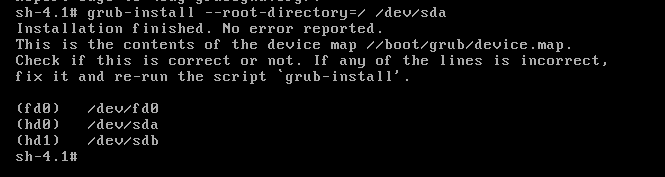

# 练习


# 新加一块硬盘，提供单独运行的bash系统

###  新增一块20G硬盘


### 创建分区以及文件系统

```powershell
fdisk /dev/sdb  后进入创建分区并写入

mkfs.ext4 /dev/sdb1  # /boot路径
mkfs.ext4 /dev/sdb2  
```


###  挂载文件系统并制作grub

```powershell
[root@host70 ~]# mount /dev/sdb1 /mnt/boot
[root@host70 ~]# cd /mnt/boot/
[root@host70 boot]# ls
lost+found
[root@host70 boot]# grub-install -h
Usage: grub-install [OPTION] install_device
Install GRUB on your drive.

  -h, --help              print this message and exit
  -v, --version           print the version information and exit
  --root-directory=DIR    install GRUB images under the directory DIR
                          instead of the root directory
  --grub-shell=FILE       use FILE as the grub shell
  --no-floppy             do not probe any floppy drive
  --force-lba             force GRUB to use LBA mode even for a buggy
                          BIOS
  --recheck               probe a device map even if it already exists
                          This flag is unreliable and its use is
                          strongly discouraged.

INSTALL_DEVICE can be a GRUB device name or a system device filename.

grub-install copies GRUB images into the DIR/boot directory specfied by
--root-directory, and uses the grub shell to install grub into the boot
sector.

Report bugs to <bug-grub@gnu.org>.
[root@host70 boot]# grub-install --root-directory=/mnt/ /dev/sdb
Probing devices to guess BIOS drives. This may take a long time.
Installation finished. No error reported.
This is the contents of the device map /mnt//boot/grub/device.map.
Check if this is correct or not. If any of the lines is incorrect,
fix it and re-run the script `grub-install'.

(fd0)   /dev/fd0
(hd0)   /dev/sda
(hd1)   /dev/sdb

# 上传 内核文件和init至/mnt/boot下
# 上传 grub.conf文件t至/mnt/boot/grub下,并修改grub参数
#boot=/dev/sda
default=0
timeout=5
title Red Hat Enterprise Linux (2.6.32-431.el6.x86_64)
        root (hd1,0)
        kernel /vmlinuz-2.6.32-431.el6.x86_64 ro root=/dev/sdb2 selinux=0  init=/bin/bash
        initrd /initramfs-2.6.32-431.el6.x86_64.img

```

### 制作/bin/bash

```powershell
[root@host70 boot]# mount /dev/sdb2 /mnt/sysroot/
[root@host70 boot]# ls
grub  initramfs-2.6.32-431.el6.x86_64.img  lost+found  vmlinuz-2.6.32-431.el6.x86_64
[root@host70 boot]# cd /mnt/sysroot/

[root@host70 sysroot]# mkdir bin boot dev etc home lib lib64  media mnt opt proc root sbin selinux srv sys tmp usr var
[root@host70 sysroot]# which /bin/bash
/bin/bash
[root@host70 sysroot]# cp /bin/bash /mnt/sysroot/bin/
# 将/bin/bash 所依赖的库文件拷贝
[root@host70 sysroot]# ldd /bin/bash
        linux-vdso.so.1 =>  (0x00007fffc2ce0000)
        libtinfo.so.5 => /lib64/libtinfo.so.5 (0x00007f9eba33e000)
        libdl.so.2 => /lib64/libdl.so.2 (0x00007f9eba13a000)
        libc.so.6 => /lib64/libc.so.6 (0x00007f9eb9da5000)
        /lib64/ld-linux-x86-64.so.2 (0x00007f9eba567000)
[root@host70 sysroot]# cp /lib64/libtinfo.so.5 /lib64/libdl.so.2 /lib64/libc.so.6 /lib64/ld-linux-x86-64.so.2 /mnt/sysroot/lib64
[root@host70 sysroot]# sync
[root@host70 bin]# chroot /mnt/sysroot/
bash-4.1#
# 正常进入Bash

```

### 在现有VM中以第二块硬盘加载/bin/bash系统

```powershell
# grub.conf 中的参考 
#
default=0
timeout=5
title Red Hat Enterprise Linux (2.6.32-431.el6.x86_64)
        root (hd1,0) #表示第二块硬盘的第一个分区
        kernel /vmlinuz-2.6.32-431.el6.x86_64 ro root=/dev/sdb2 selinux=0  init=/bin/bash  # 第一个分区sdb1为boot 第二个分区sdb2为根目录
        initrd /initramfs-2.6.32-431.el6.x86_64.img
```


正常进入


### 模拟硬盘拆下来后插到一个新的机器上

1）还原至正常系统，进入grub命令行界面，输入如下命令

```perl
root (hd0,0)
kernel /vmlinuz-2.6.32-431.el6.x86_64 ro root=/dev/mapper/vg_host70-lv_root  selinx=0
initrd /initramfs-2.6.32-431.el6.x86_64.img
boot
```

2） 修改grub.conf 文件


3）新建一个VM，硬盘为上图中的disk 载入系统即可


#  /boot 目录清理后，grub损坏修复

### 现象


### 处理步骤

#### 1）将光盘挂载，ESC后进入系统拯救模式

#### 2）确认系统的根文件是否损坏，没有损坏，系统将会挂载到 /mnt/sysimage下，需要切换至系统中运行如下命令 chroot /mnt/sysimage

#### 3）lsblk命令查看根文件在哪个磁盘以及分区中


#### 4）重新安装grub ， grub-install --root-directory=/ /dev/sda



#### 5）将内核文件和initi镜像文件拷贝到/boot下面，以便grub识别

```powershell
cp /boot/grub/initramfs*.img  /boot/grub/vmlinux* /boot
```


#### 6）修改/boot/grub/grub.conf文件

```powershell
# grub.conf generated by anaconda
#
# Note that you do not have to rerun grub after making changes to this file
# NOTICE:  You have a /boot partition.  This means that
#          all kernel and initrd paths are relative to /boot/, eg.
#          root (hd0,0)
#          kernel /vmlinuz-version ro root=/dev/mapper/vg_host70-lv_root
#          initrd /initrd-[generic-]version.img
#boot=/dev/sda
default=0
timeout=5
splashimage=(hd0,0)/grub/splash.xpm.gz
hiddenmenu
title Red Hat Enterprise Linux (2.6.32-431.el6.x86_64)
	root (hd0,0)
	kernel /vmlinuz-2.6.32-431.el6.x86_64 ro root=/dev/mapper/vg_host70-lv_root rd_NO_LUKS crashkernel=auto rd_LVM_LV=vg_host70/lv_swap rd_NO_MD rd_LVM_LV=vg_host70/lv_root LANG=zh_CN.UTF-8  KEYBOARDTYPE=pc KEYTABLE=us rd_NO_DM rhgb quiet  selinux=0
	initrd /initramfs-2.6.32-431.el6.x86_64.img
# 其中root以实际系统分区为准
```

#### 7）重启系统正常。


